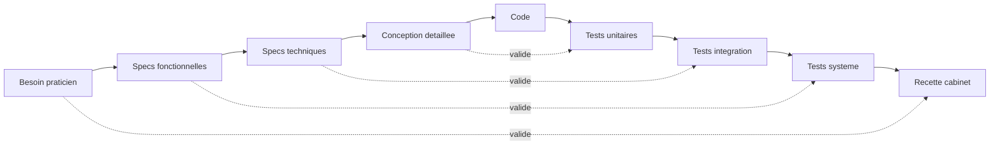

# Plan projet en cycle V et sprints

## Lecture du cycle en V appliqué

Le cycle en V structure le projet en deux versants symétriques. Le versant descendant définit ce qui doit être fait, du plus général au plus précis, en partant du besoin exprimé par le praticien jusqu'au code. Le versant montant valide ce qui a été fait, du plus précis au plus général, en partant des tests unitaires jusqu'à la recette finale en cabinet. Chaque niveau du versant descendant a son test miroir dans le versant montant.

Pour ce projet la lecture concrète est la suivante. Le besoin exprimé est le dispositif tablette plus PC pour l'entraînement et le suivi de patients TDAH et autisme. Les spécifications fonctionnelles décrivent les écrans, les jeux, le contenu des fiches et le format d'échange. Les spécifications techniques décrivent la stack, les bases de données, le protocole QR et les contrats de données. La conception détaillée définit l'arborescence du code, les modules et les interfaces. Le code implémente ces interfaces. Côté validation les tests unitaires vérifient chaque fonction, les tests d'intégration vérifient les interactions entre modules notamment le canal QR, les tests système vérifient les deux applications ensemble, et la recette vérifie l'usage réel en cabinet.

## Calendrier global

La présentation est positionnée fin juin. Le démarrage effectif intervient début mai. Cinq sprints de deux semaines couvrent la période, le dernier étant un sprint court de stabilisation et de préparation de la soutenance.

## Sprint 1 : amorçage technique

Le premier sprint pose les fondations. Il couvre la création du dépôt local dans le répertoire `/home/cengi/projects/projet_annuel/`, l'initialisation des deux sous-projets `tablette_flutter` et `logiciel_pc_go`, la rédaction des fichiers de configuration de Claude Code dont le `CLAUDE.md` racine et les `CLAUDE.md` par sous-projet, l'écriture des premiers ADR sur les choix techniques structurants, la mise en place d'un squelette Flutter qui build et s'installe sur la Lenovo Tab P12, la mise en place d'un squelette Go qui compile en exécutable Windows par compilation croisée depuis Arch Linux, et la rédaction d'un compte rendu de sprint. Aucune logique métier n'est codée dans ce sprint.

Les livrables sont un `README.md` racine, deux applications buildables affichant un écran d'accueil, deux fichiers `CLAUDE.md` opérationnels, trois ADR couvrant Flutter Android, Go Windows et le choix SQLite, et un compte rendu de sprint dans `docs/comptes_rendus/sprint_01.md`.

## Sprint 2 : canal QR et appairage

Le deuxième sprint construit le système nerveux du projet. Il couvre la spécification du protocole d'échange par QR code, l'implémentation côté Go d'un module qui génère un QR contenant les paramètres d'appairage, l'implémentation côté Flutter d'un scanner caméra qui lit ce QR et stocke localement la clé d'appairage, l'implémentation côté Flutter d'un générateur de QR pour exporter une charge utile de session, l'implémentation côté Go d'un module qui scanne via webcam et reconstitue la charge utile, le format de données échangé entre les deux mondes basé sur JSON compressé et signé, et les tests d'intégration de ce canal.

Les livrables sont un document de spécification du protocole QR dans `docs/specs/protocole_qr.md`, deux modules de code testés, et un compte rendu de sprint.

## Sprint 3 : jeu de reconnaissance des émotions

Le troisième sprint produit le contenu central de la tablette. Il couvre la spécification fonctionnelle du jeu, l'acquisition ou la production des images de visages exprimant les six émotions de base, l'implémentation de l'écran de création de profil patient par initiales et identifiant aléatoire, l'implémentation de la boucle de jeu avec affichage d'une planche de visages et mise en évidence visuelle de la sélection, le calcul des métriques par tentative et par session, le stockage local SQLite côté tablette, et le calibrage des trois niveaux de difficulté facile, moyen et difficile.

Les livrables sont un document de spécification du jeu dans `docs/specs/jeu_emotions.md`, l'application tablette fonctionnelle pour ce jeu, et un compte rendu de sprint.

## Sprint 4 : logiciel praticien

Le quatrième sprint produit le côté PC. Il couvre la spécification de l'interface praticien, l'implémentation de la création et de l'édition de fiches patients nominatives, le stockage SQLite côté PC, l'écran de réception des données par scan webcam du QR généré par la tablette, l'association entre les données reçues et la fiche patient correspondante via les initiales et l'identifiant, et l'affichage d'un graphique d'évolution par patient sur les sessions enregistrées.

Les livrables sont un document de spécification du logiciel praticien dans `docs/specs/logiciel_pc.md`, l'application Windows fonctionnelle, et un compte rendu de sprint.

## Sprint 5 : recette, polish, soutenance

Le dernier sprint, plus court, couvre les tests système de bout en bout, une session de recette avec le praticien sur un cas réel ou simulé, la correction des défauts remontés, la préparation des supports de soutenance comprenant la note de présentation et les démonstrations, et la rédaction du dossier de rendu final qui agrège tous les comptes rendus, ADR et spécifications.

Les livrables sont le dossier de rendu final, le support de soutenance, et un compte rendu de clôture.

## Matrice d'exigences

La matrice d'exigences trace le lien entre les besoins exprimés et les éléments qui les valident. Elle est tenue à jour à chaque sprint et complétée par les identifiants de tests unitaires et d'intégration au fur et à mesure que ceux-ci sont écrits.

| ID    | Exigence                                                                    | Sprint | Statut  | Validation                       |
| ----- | --------------------------------------------------------------------------- | ------ | ------- | -------------------------------- |
| EX-01 | La tablette ne stocke aucune donnée nominative                              | 1      | À faire | Revue de code et schéma SQLite   |
| EX-02 | Le profil patient sur tablette utilise initiales et identifiant aléatoire   | 3      | À faire | Test unitaire sur la génération  |
| EX-03 | L'identifiant aléatoire est unique par patient                              | 3      | À faire | Test unitaire avec collisions    |
| EX-04 | Aucune connexion internet n'est requise                                     | 1      | À faire | Recette en mode avion            |
| EX-05 | Le PC scanne un QR généré par la tablette pour récupérer une session        | 2      | À faire | Test d'intégration               |
| EX-06 | La tablette scanne un QR généré par le PC pour l'appairage initial          | 2      | À faire | Test d'intégration               |
| EX-07 | Le jeu des émotions affiche un retour temps réel vert ou rouge              | 3      | À faire | Test système                     |
| EX-08 | Le jeu propose au moins trois niveaux de difficulté                         | 3      | À faire | Revue fonctionnelle              |
| EX-09 | Les métriques temps de réaction, succès, erreurs et abandons sont stockées  | 3      | À faire | Inspection de la base SQLite     |
| EX-10 | Le PC affiche un graphique d'évolution par patient                          | 4      | À faire | Recette praticien                |
| EX-11 | Les données échangées par QR sont signées pour empêcher la falsification    | 2      | À faire | Test unitaire de la signature    |
| EX-12 | Une session complète peut être démontrée de bout en bout                    | 5      | À faire | Recette finale                   |
