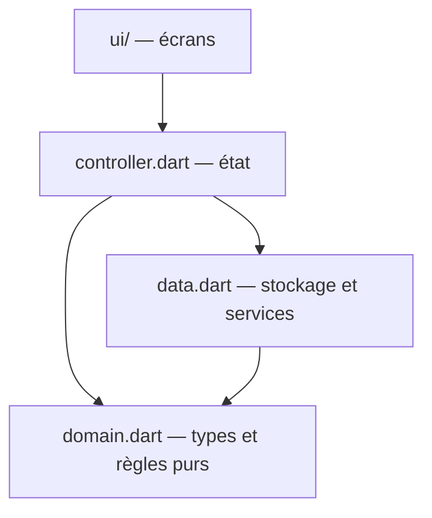
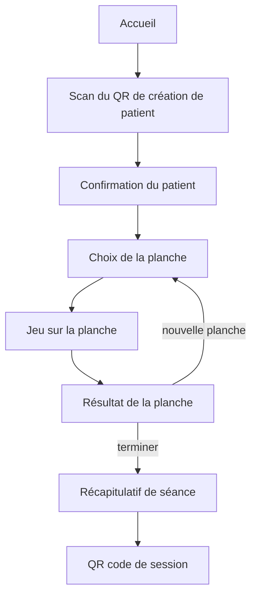

# OSEE — Documentation de l'application tablette

---

## 1. Présentation de l'application tablette

L'application tablette est la partie du dispositif OSEE avec laquelle l'enfant joue. Elle tourne sur une tablette Android, en plein écran et au doigt. C'est l'outil de séance : le praticien y charge un patient, l'enfant joue, et l'application produit à la fin un QR code qui contient les résultats.

L'application fait trois choses. Elle reçoit un patient et un niveau en scannant le QR code de création de patient affiché par l'ordinateur. Elle déroule la séance de jeu sur les émotions, en mesurant ce que l'enfant trouve et ce qu'il rate. Elle produit à la fin un QR code de session, que le praticien scanne avec l'ordinateur pour récupérer les résultats.

L'application ne garde aucune donnée nominative de façon durable. Elle ne connaît pas la liste des patients, elle ne conserve pas d'historique. Elle travaille le temps d'une séance avec le patient que le praticien lui a transmis, et garde juste ce qu'il faut pour reprendre la séance en cours si elle est interrompue. Comme le reste du dispositif, elle n'a aucune connexion réseau : tout passe par les QR codes.

L'application est écrite avec Flutter, en langage Dart. Elle se compile en un paquet Android installable sur la tablette.

---

## 2. L'architecture par feature

Le code est organisé par fonctionnalité, et non par type de fichier. Chaque fonctionnalité a son dossier, et à l'intérieur les fichiers sont rangés par couche. Cette organisation est sous tablette_flutter/lib/.

Le point d'entrée est main.dart. Il ouvre le stockage, lit le contexte de séance qui aurait été sauvegardé, met en place la gestion d'état et lance l'application.

Le dossier app/ contient la configuration de la navigation, dans router.dart. Le dossier core/ contient ce qui est transverse à toute l'application : la signature Ed25519 dans crypto.dart, la sérialisation et la signature des enveloppes dans qr_envelope.dart, le stockage SQLite dans stockage.dart, et toutes les chaînes de texte de l'interface dans textes.dart. Le dossier features/ contient une fonctionnalité par dossier : l'accueil, l'appairage et le jeu des émotions. Le dossier shared_widgets/ contient un widget de scan de QR réutilisable.

À l'intérieur d'une fonctionnalité, les fichiers suivent toujours les mêmes couches. Le fichier domain.dart contient les types métier et les règles, sans rien qui touche à l'affichage. Le fichier data.dart contient l'accès au stockage et aux services. Le fichier controller.dart contient la gestion d'état. Le dossier ui/ contient les écrans.



Le point important est que le domaine ne dépend de rien qui touche à l'affichage. Les fichiers domain.dart du jeu et de l'appairage n'importent aucune bibliothèque Flutter ; c'est du Dart pur. C'est le fichier controller.dart qui fait le lien avec Flutter. Cette séparation rend les règles du jeu, comme le calcul du score, testables sans avoir besoin d'un écran.

---

## 3. Le déroulé d'une séance

Une séance suit toujours le même enchaînement d'écrans, depuis l'accueil jusqu'à l'envoi des résultats.

Tout commence sur l'accueil. Le praticien lance le scan du QR de création de patient. Une fois le patient reconnu, l'application affiche un écran de confirmation, qui montre le patient chargé. De là, le praticien passe au choix de la planche. Une planche est lancée, l'enfant joue, puis l'application affiche le résultat de la planche. Le praticien peut alors enchaîner sur une nouvelle planche, ou terminer la séance. À la fin, l'application montre un récapitulatif de la séance, puis produit le QR code de session que le praticien scanne avec l'ordinateur.



Un mode de démonstration existe en parallèle. Il charge un patient fictif sans passer par le scan, ce qui permet de présenter le jeu sans avoir l'ordinateur en face.

---

## 4. L'appairage et la création de patient

Avant de pouvoir vérifier les messages de l'ordinateur, la tablette doit être appairée avec lui. L'appairage échange les clés publiques des deux appareils. Cette fonctionnalité est dans le dossier appairage/.

L'état de l'appairage est décrit par un type fermé, qui ne peut prendre qu'un nombre fini de formes. Il passe de l'état initial à l'état en cours, puis à la réussite ou à l'échec.

`lib/features/appairage/domain.dart`
```dart
sealed class EtatAppairage
// AppairageInitial | AppairageEnCours | AppairageReussi | AppairageEchec
```

Quand la tablette scanne un QR, le résultat de l'analyse de l'enveloppe est lui aussi décrit par un type fermé. Cela force le code à traiter tous les cas : une enveloppe d'appairage du PC, une création de patient vérifiée, une enveloppe non appairée, une signature invalide, ou une enveloppe illisible.

`lib/features/appairage/domain.dart`
```dart
sealed class ResultatEnveloppe
// EnveloppeAppairagePc | EnveloppeCreationPatientVerifiee | EnveloppeNonAppairee | EnveloppeSignatureInvalide | EnveloppeIllisible
```

Pour une création de patient, l'enveloppe vérifiée porte l'identifiant du patient, ses initiales et le niveau demandé. La vérification de la signature utilise la clé publique de l'ordinateur, reçue lors de l'appairage. Si la signature est bonne, le patient est chargé dans la séance.

---

## 5. Le jeu des émotions

Le cœur de l'application est le moteur de jeu, qui gère une planche. Il est dans lib/features/jeu_emotions/controller.dart, dans la classe MoteurPlanche.

Une planche est une image qui contient des personnages, chacun exprimant une émotion. Le but est de retrouver les personnages d'une émotion donnée. Le jeu fonctionne en navigation libre : à tout moment, le praticien choisit l'émotion recherchée, et les taps de l'enfant sont évalués par rapport à cette émotion.

`lib/features/jeu_emotions/controller.dart`
```dart
ResultatTap taper(int tapX, int tapY)
```

Quand l'enfant touche l'écran, le moteur regarde où le doigt s'est posé. S'il n'y a pas d'émotion sélectionnée, rien ne se passe. Sinon, le moteur cherche un personnage à cet endroit. Si le tap tombe sur un personnage de l'émotion recherchée, c'est une cible trouvée. Si le tap tombe sur un personnage d'une autre émotion, c'est un faux positif. Si le tap tombe à côté, rien ne se passe. Le résultat de chaque tap est, là encore, décrit par un type fermé : aucun, cible, ou faux positif.

Les marqueurs affichés sur la planche n'ont pas la même portée. Les marqueurs verts, qui signalent les cibles trouvées, sont gardés et affichés pour toutes les émotions : une fois qu'un personnage est trouvé, sa pastille verte reste. Les marqueurs rouges, qui signalent les faux positifs, ne sont affichés que pour l'émotion en cours de sélection. Cela évite de surcharger l'image avec toutes les erreurs de toutes les émotions en même temps.

Le score se calcule par émotion, avec une règle précise. Il récompense les cibles trouvées, pénalise les cibles ratées, et retire des points pour chaque faux positif. La fonction de calcul est dans le domaine.

`lib/features/jeu_emotions/domain.dart`
```dart
int calculerScore({required int T, required int R, required int F}) {
    if (T + R == 0) return 0;
    final brut = (T / (T + R)) * 100.0 - F * penaliteFauxPositif;
    return brut.clamp(0.0, 100.0).round();
}
```

Dans cette formule, T est le nombre de cibles trouvées, R le nombre de cibles ratées, et F le nombre de faux positifs. Chaque faux positif retire cinq points. Le résultat est borné entre zéro et cent. Le score global d'une planche est la moyenne arrondie des scores des émotions évaluées. Un système d'étoiles accompagne le score, avec deux étoiles à partir de 41 et trois étoiles à partir de 76.

À la fin d'une planche, le moteur produit un récapitulatif de ce qui a été joué, en tenant compte des seules émotions retenues pour l'évaluation.

`lib/features/jeu_emotions/controller.dart`
```dart
PlancheJouee terminerPlanche(List<String> emotionsRetenues)
```

---

## 6. Les types métier

Les données du jeu sont représentées par quelques modèles simples, dans lib/features/jeu_emotions/domain.dart.

Une planche connaît son image, sa taille et la liste de ses personnages. Un personnage connaît sa position, sa taille et son émotion.

`lib/features/jeu_emotions/domain.dart`
```dart
class Planche {
    final String cheminAsset;
    final int largeur;
    final int hauteur;
    final List<PersonnageAnnotation> personnages;
}

class PersonnageAnnotation {
    final int x;
    final int y;
    final int rayon;
    final String emotion;
}
```

Le résultat d'une émotion sur une planche rassemble les compteurs, le score et l'indication d'évaluation. Une planche jouée rassemble les résultats de ses émotions et son score global.

`lib/features/jeu_emotions/domain.dart`
```dart
class ResultatEmotion {
    final String emotion;
    final int nbCiblesTotal;
    final int nbCiblesTrouvees;
    final int nbFauxPositifs;
    final int score;
    final bool evaluee;
}

class PlancheJouee {
    final int numeroPlanche;
    final List<ResultatEmotion> resultatsParEmotion;
    final int scoreGlobal;
}
```

Les quatre émotions, la joie, la colère, la tristesse et la peur, sont regroupées dans une liste ordonnée, toujours utilisée dans le même ordre.

---

## 7. Le contrôleur et l'état

La gestion de l'état s'appuie sur Riverpod. L'état est porté par des fournisseurs, dans lib/features/jeu_emotions/controller.dart.

L'état de la séance dit s'il y a un patient chargé ou non. C'est un type fermé, à deux formes : aucun patient chargé, ou un patient chargé avec sa séance en cours.

`lib/features/jeu_emotions/controller.dart`
```dart
sealed class EtatSession
// AucunPatientCharge | PatientCharge
```

Trois fournisseurs principaux portent l'état. Un fournisseur pour la séance en cours, un pour la liste des planches déjà jouées dans la séance, et un pour la planche en cours de jeu. Le contrôleur de séance gère les transitions.

`lib/features/jeu_emotions/controller.dart`
```dart
class ControleurSession extends Notifier<EtatSession> {
    void charger(PayloadCreationPatient patient)
    void chargerDemo()
    void reinitialiser()
}
```

Charger un patient vide les planches de la séance précédente, passe à l'état patient chargé, et sauvegarde le contexte. Charger la démonstration fait la même chose avec un patient fictif. Réinitialiser vide les planches, revient à aucun patient chargé, et efface le contexte sauvegardé. Le fait de vider les planches au chargement d'un patient garantit qu'une nouvelle séance repart propre, et que les planches d'un enfant ne se mélangent pas à celles d'un autre.

---

## 8. La génération du QR de session

À la fin d'une séance, l'application assemble les résultats et produit un QR code signé. Cette génération est dans lib/features/jeu_emotions/data.dart.

`lib/features/jeu_emotions/data.dart`
```dart
Future<EnveloppeQr> construireQrSession({required Session session, required List<int> tabPriv, DateTime? horodatage})
```

La fonction commence par sérialiser la séance en un contenu structuré, avec l'identifiant du patient, ses initiales, la date, le type de jeu, le niveau et la liste des planches. Elle construit ensuite l'enveloppe et la signe avec la clé privée de la tablette. La construction de l'enveloppe enchaîne la sérialisation canonique, la signature Ed25519, puis la compression en zlib et l'encodage en base64 pour produire le texte du QR. C'est ce texte que l'ordinateur lira et vérifiera avec la clé publique de la tablette.

La liste des planches utilisée pour construire la séance vient du fournisseur qui a accumulé les planches jouées tout au long de la séance.

---

## 9. La persistance du contexte

L'application garde le strict minimum entre deux lancements : le contexte de la séance en cours. Le stockage est dans lib/core/stockage.dart, dans une table qui ne contient qu'une seule ligne.

`lib/core/stockage.dart`
```sql
CREATE TABLE contexte_session (
    id INTEGER PRIMARY KEY CHECK (id = 1),
    patient_id TEXT NOT NULL,
    patient_initiales TEXT NOT NULL,
    niveau_demande INTEGER NOT NULL,
    est_demo INTEGER NOT NULL
);
```

Une façade métier, dans data.dart, expose l'enregistrement, la lecture et l'effacement de ce contexte. Au démarrage, l'application lit ce contexte. S'il existe, elle restaure le patient et démarre directement sur l'écran de choix de planche ; sinon, elle démarre sur l'accueil.

`main.dart`
```dart
final contexteRestaure = await DepotContexteSession(stockage).lire();
```

Ce choix répond à un problème précis, documenté dans l'ADR-09. Android peut fermer une application passée en arrière-plan pour récupérer de la mémoire. Sans sauvegarde, une séance commencée serait perdue si le praticien change d'application un instant. En gardant le patient courant et l'indication de démonstration, l'application peut reprendre la séance après une telle fermeture. C'est pourquoi seul le contexte de séance est persisté, et rien d'autre.

---

## 10. La navigation

La navigation utilise go_router. Elle est configurée dans lib/app/router.dart. L'application compte huit écrans, chacun associé à une route nommée.

`lib/app/router.dart`
```
/                      accueil
/appairage             appairage
/confirmation-patient  confirmation du patient
/choix-planche         choix de la planche
/jeu                   jeu
/resultat-planche      résultat de la planche
/recapitulatif-seance  récapitulatif de séance
/export-session        export de session
```

Toutes les transitions se font par remplacement de l'écran courant, sans empiler les écrans. Ce choix simple a une conséquence : par défaut, il n'y a pas de flèche de retour automatique, et le retour d'Android quitterait l'application.

Pour combler ce manque sur l'écran de choix de planche, un retour vers l'accueil a été ajouté, sans réinitialiser la séance. Il prend deux formes qui font la même chose : une flèche de retour dans la barre du haut, et l'interception du retour d'Android.

`lib/features/jeu_emotions/ui/choix_planche_screen.dart`
```dart
void _retourAccueil() => context.go('/');

Widget _enveloppeRetour({required Widget child}) => PopScope(
    canPop: false,
    onPopInvokedWithResult: (didPop, result) { if (didPop) return; _retourAccueil(); },
    child: child,
);
```

Ce retour ramène à l'accueil en gardant le patient, l'appairage et les planches déjà jouées. Il ne réinitialise rien ; c'est seulement de la navigation. Pour que ce retour ait du sens, l'accueil reconnaît qu'une séance est en cours et propose de la reprendre. Le patient n'est remplacé que si le praticien scanne un nouveau QR de création de patient.

---

## 11. Les écrans

Chaque écran a son fichier, dans les dossiers ui/ des fonctionnalités.

L'accueil est dans features/accueil/ui/accueil_screen.dart. L'appairage est dans features/appairage/ui/appairage_screen.dart. Les autres écrans appartiennent au jeu et sont dans features/jeu_emotions/ui/ : la confirmation du patient, le choix de la planche, le jeu lui-même, le résultat de la planche, le récapitulatif de séance et l'export de session. Un widget de scan de QR réutilisable est dans lib/shared_widgets/page_scanner_qr.dart, et sert partout où il faut lire un QR code.

---

## 12. Compilation

L'application se compile en un paquet Android installable. La commande exacte est donnée dans la documentation générale.

L'essentiel à retenir est que la compilation se lance depuis le dossier de l'application tablette, et produit un paquet qui est ensuite installé sur la tablette physique. Lancer la compilation depuis le mauvais dossier fait échouer la construction, et peut conduire à réinstaller un ancien paquet sans s'en rendre compte.

---

*Documentation de l'application tablette. Le fonctionnement d'ensemble du dispositif et le protocole d'échange sont décrits dans la documentation générale. Le logiciel de l'ordinateur est décrit dans sa propre documentation.*
