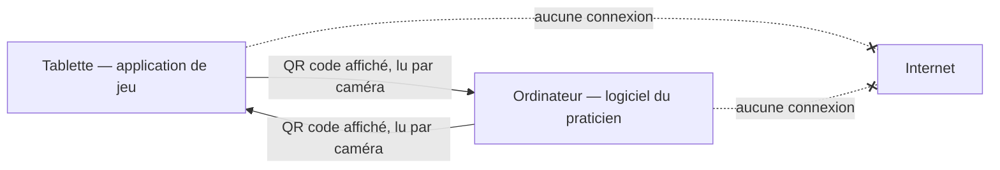
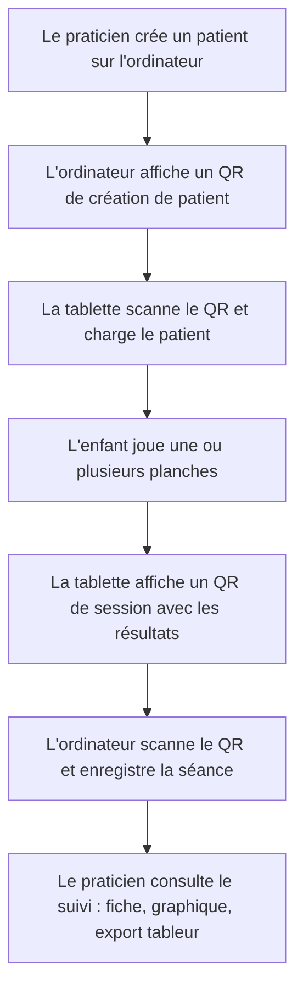
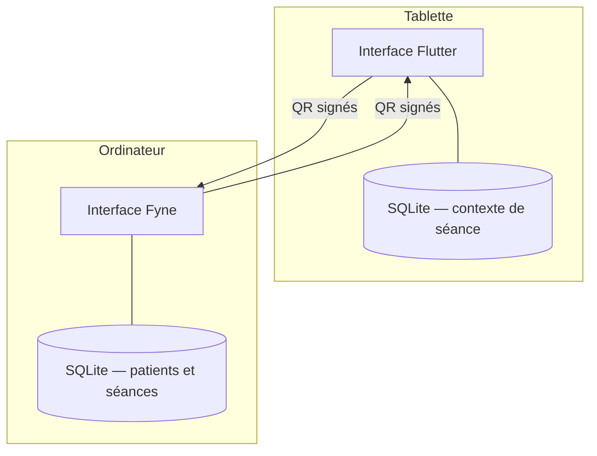
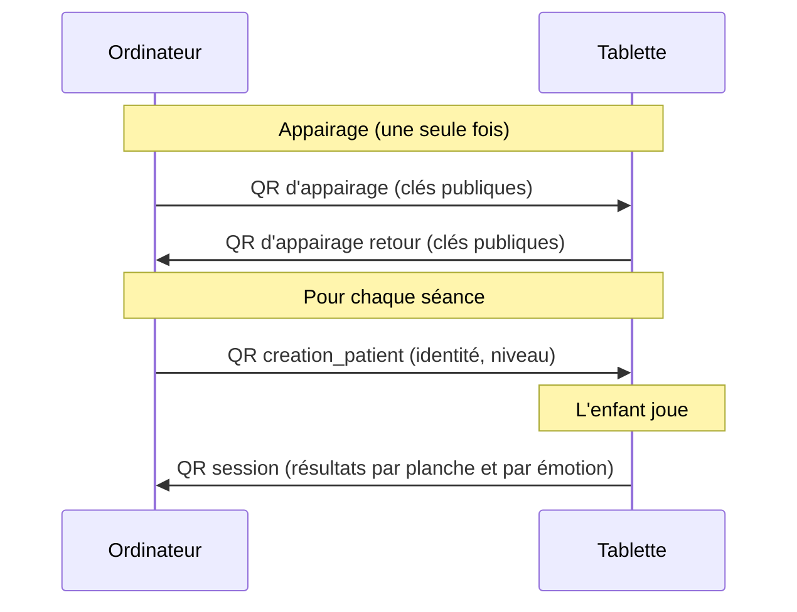
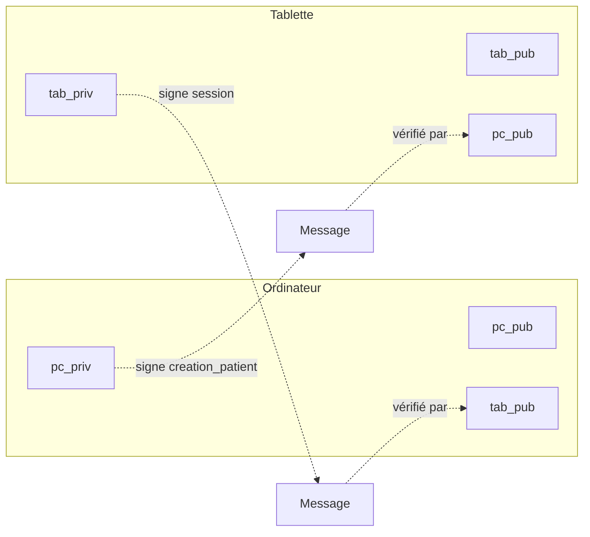
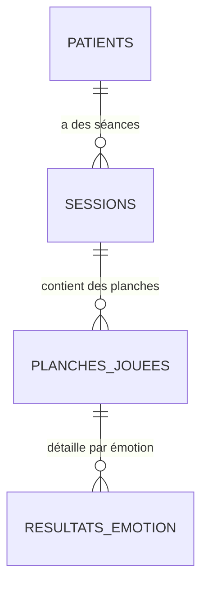

# OSEE — Documentation générale

---

## 1. Présentation du projet

Ce projet, nommé **OSEE** (*Outil de Suivi de l'Évolution Émotionnelle*), est un dispositif logiciel destiné à un praticien qui accompagne des enfants dans la reconnaissance des émotions. Il s'adresse en particulier au suivi d'enfants présentant un trouble du déficit de l'attention avec ou sans hyperactivité (TDAH) ou un trouble du spectre de l'autisme, pour qui la reconnaissance des émotions sur un visage peut représenter une difficulté spécifique. Le dispositif se compose de deux applications complémentaires. Une application sur tablette, avec laquelle l'enfant joue à reconnaître des émotions sur des visages. Un logiciel sur ordinateur, avec lequel le praticien gère ses patients et suit l'évolution de chacun au fil des séances.

Le jeu proposé sur la tablette reprend le principe des images « où est Charlie ». Une planche illustrée est affichée en plein écran, et l'enfant doit y retrouver les visages exprimant une émotion donnée, parmi la joie, la colère, la tristesse et la peur. Chaque visage trouvé au bon endroit est validé, chaque erreur est enregistrée. À la fin d'une séance, les résultats détaillés par émotion sont transmis à l'ordinateur du praticien, qui les conserve et permet d'observer la progression de l'enfant sur la durée.

La particularité centrale du dispositif est qu'il fonctionne entièrement sans réseau. La tablette et l'ordinateur ne sont jamais connectés à internet, et ne communiquent pas non plus directement entre eux. Tout échange de données passe par des QR codes affichés à l'écran d'un appareil et scannés par l'autre. Ce choix répond à une exigence de confidentialité : les données concernent des enfants mineurs suivis dans un cadre de soin, et le dispositif est conçu pour qu'aucune de ces données ne puisse fuir par le réseau.

> [!note] Deux applications, un seul système
> La tablette et l'ordinateur forment un seul dispositif, mais portent des responsabilités distinctes. La tablette est un outil de jeu qui ne conserve aucune donnée nominative. L'ordinateur est l'outil du praticien, qui détient l'identité des patients et l'historique de leurs séances. Cette séparation est détaillée dans la section consacrée à l'architecture.

---

## 2. Persona — pour qui

Le dispositif a deux utilisateurs, qui ne se servent pas des mêmes écrans et n'ont pas les mêmes attentes.

### Le praticien

Le praticien est l'utilisateur principal. Il accompagne des enfants sur des questions d'attention et de reconnaissance des émotions, et a besoin d'un outil qui lui permette de mener des séances de jeu, puis de suivre objectivement la progression de chaque enfant. Ses attentes portent sur trois points. La confidentialité d'abord, car il manipule des données concernant des mineurs suivis, et il a la responsabilité de ne pas les exposer. La simplicité ensuite, car l'outil doit s'effacer derrière la séance et ne pas demander de compétence technique particulière. La lisibilité du suivi enfin, car l'intérêt clinique du dispositif tient à sa capacité à montrer, émotion par émotion et séance après séance, si l'enfant progresse, et sur quelles émotions il rencontre des difficultés.

Sa principale contrainte est qu'il n'est pas informaticien. L'outil doit donc rester direct, sans configuration réseau, sans compte à créer, sans paramétrage complexe.

### L'enfant

L'enfant est l'utilisateur de la tablette pendant la séance. Il joue à retrouver des visages, guidé par le praticien. Ses attentes sont celles d'un jeu : un retour immédiat quand il trouve un visage, une difficulté adaptée, et une expérience qui ne le met jamais en situation d'échec brutal. L'interface de la tablette est donc conçue pour être grande, tactile, et claire, avec des repères visuels simples comme des marqueurs de couleur sur les visages trouvés.

> [!note] Un dispositif piloté par le praticien
> L'enfant joue, mais c'est le praticien qui mène la séance : il charge le patient, choisit le niveau, décide quelles planches sont jouées, et transmet les résultats. La tablette n'a donc pas besoin de gérer de comptes ni d'identité ; elle reçoit le contexte du praticien au début de la séance et le lui renvoie à la fin.

---

## 3. La valeur

Le dispositif rend un service précis : transformer une séance de jeu en données de suivi exploitables, sans jamais exposer ces données.

La première valeur est le suivi objectif. Là où une observation à l'œil reste subjective, le dispositif mesure pour chaque émotion le nombre de visages correctement trouvés, le nombre d'erreurs et un score, et il agrège ces mesures séance après séance. Le praticien dispose ainsi d'une trace chiffrée de la progression, qui distingue les émotions maîtrisées de celles qui posent encore problème.

La deuxième valeur est la confidentialité par construction. Le dispositif ne peut pas fuiter de données par le réseau, simplement parce qu'il n'a pas de réseau. Les seules données qui circulent passent par des QR codes, sous une forme signée, et les données nominatives ne quittent jamais l'ordinateur du praticien.

La troisième valeur est la simplicité d'usage. Le praticien n'a aucune infrastructure à installer, aucun serveur, aucun compte. Deux appareils, une caméra pour lire les QR codes, et le dispositif fonctionne de façon autonome.

> [!quote] Les valeurs du dispositif
> Suivi objectif de la progression, confidentialité par construction, et simplicité d'usage pour un praticien non informaticien.

---

## 4. Le périmètre

### Ce qui est réalisé

Le dispositif réalisé couvre un parcours complet. Le praticien peut créer un patient sur l'ordinateur, transmettre ce patient à la tablette par QR code, mener une séance de jeu sur les émotions, puis transmettre les résultats détaillés à l'ordinateur, qui les enregistre et permet d'en consulter le suivi sous forme de fiches, de graphiques d'évolution et d'un export tableur par patient. L'appairage initial entre les deux appareils, qui établit la confiance cryptographique, fait partie du périmètre, de même qu'un mode de démonstration permettant de présenter le dispositif sans matériel complet.

Un seul jeu est développé, le jeu de reconnaissance des émotions. Quatre émotions sont prises en charge : la joie, la colère, la tristesse et la peur.

### Ce qui n'est pas réalisé

Le dispositif est volontairement limité à un périmètre maîtrisable. D'autres jeux cognitifs pourraient compléter le dispositif, mais ne sont pas développés. Sur la tablette, certaines entrées de l'écran d'accueil, comme la reprise d'un patient existant déjà stocké ou un écran de réglages, sont prévues dans l'interface mais ne sont pas implémentées. Ces points sont présentés comme des perspectives, et non comme des fonctionnalités attendues du périmètre actuel.

> [!attention] Périmètre assumé
> Le choix d'un seul jeu, abouti et testé, plutôt que de plusieurs jeux incomplets, est un parti pris assumé. Il garantit que le parcours complet, du jeu au suivi, fonctionne de bout en bout et a été validé sur le matériel réel.

---

## 5. Organisation du travail

Le projet est mené en solo. L'organisation s'appuie sur trois principes qui ont structuré le développement.

Le travail est découpé en sprints successifs, chacun centré sur un objectif clair, depuis l'infrastructure de communication jusqu'au suivi patient, en passant par le jeu lui-même. Chaque évolution significative est validée et testée avant de passer à la suivante.

Les décisions d'architecture importantes sont tracées sous forme de décisions d'architecture documentées, un format court où chaque décision est consignée avec son contexte, les options envisagées et la décision retenue. Une décision validée n'est jamais modifiée ; lorsqu'un choix évolue, une nouvelle décision vient remplacer ou compléter la précédente. Cette discipline laisse une trace claire du raisonnement suivi tout au long du projet.

Le développement s'appuie sur des outils d'assistance à l'écriture de code, utilisés en gardant une validation humaine systématique : chaque tâche est décrite, exécutée, puis vérifiée avant d'être intégrée. Les modifications sont validées sur le matériel réel, la tablette physique et l'ordinateur, et pas seulement en environnement de test.

---

## 6. Le principe fondamental — un système sans réseau

Le dispositif repose sur un principe non négociable : aucune communication réseau. Ce principe oriente toute l'architecture.

Ni la tablette ni l'ordinateur ne sont connectés à internet, et les deux appareils ne sont reliés par aucun lien direct, ni filaire ni sans fil. La seule façon dont une information passe d'un appareil à l'autre est l'affichage d'un QR code à l'écran de l'un, lu par la caméra de l'autre. Cette isolation complète porte un nom : un système ainsi coupé de tout réseau est dit en « air gap ».



> [!definition] Air gap
> Un air gap désigne l'isolement physique d'un système, qui n'est relié à aucun réseau. Aucune donnée ne peut entrer ou sortir par voie réseau, ce qui élimine toute une catégorie de fuites et d'intrusions. Le prix de cette sécurité est que les échanges légitimes doivent passer par un autre canal, ici le QR code.

Le choix de l'air gap découle directement de la nature des données. Le dispositif manipule des informations concernant des enfants suivis, qui doivent rester strictement sous le contrôle du praticien. En supprimant le réseau, on supprime la possibilité même qu'une donnée s'échappe ou qu'un tiers accède au dispositif à distance. La confidentialité n'est pas seulement une règle appliquée par le logiciel, elle est garantie par l'architecture.

---

## 7. Architecture fonctionnelle

D'un point de vue fonctionnel, le dispositif répartit clairement les rôles entre les deux appareils.

L'ordinateur du praticien est le détenteur des données. C'est lui qui crée les patients, qui conserve leur identité, et qui enregistre l'historique de toutes les séances. C'est aussi lui qui produit le suivi, sous forme de fiches, de graphiques et d'export tableur. L'ordinateur ne participe pas au jeu lui-même.

La tablette est l'outil de jeu. Elle reçoit un patient et un niveau de la part de l'ordinateur, déroule la séance de jeu, mesure les résultats, puis les renvoie. La tablette ne conserve pas durablement l'identité des patients ; elle travaille le temps d'une séance avec le contexte que le praticien lui a transmis.

Le parcours complet d'une utilisation suit toujours le même enchaînement.



Avant ce parcours, une étape préalable n'a lieu qu'une fois : l'appairage. L'appairage établit la confiance entre les deux appareils, en échangeant leurs clés de signature. Une fois les appareils appairés, le praticien peut créer autant de patients et mener autant de séances qu'il le souhaite sans refaire cette étape.

---

## 8. Architecture technique

Les deux applications sont construites avec des technologies différentes, choisies pour s'adapter à chaque appareil.

L'application de la tablette est développée avec Flutter, en langage Dart. Flutter permet de produire une application Android tactile, adaptée à l'écran de la tablette et à l'interaction au doigt.

Le logiciel de l'ordinateur est développé en Go, avec la bibliothèque d'interface Fyne. Go produit un exécutable autonome pour l'ordinateur du praticien, sous Windows, sans dépendance à installer.

Les deux applications stockent leurs données localement avec SQLite, une base de données légère contenue dans un simple fichier, sans serveur. Sur l'ordinateur, SQLite conserve les patients et l'historique des séances ; sur la tablette, il conserve uniquement le contexte minimal de la séance en cours.



Le lien entre les deux mondes est le canal QR. Les messages échangés respectent un format commun, sont signés cryptographiquement, et sont compris à l'identique des deux côtés. C'est ce contrat partagé qui permet à une application Dart et à une application Go de fonctionner ensemble. Le détail de ce contrat fait l'objet des sections suivantes.

> [!note] Deux implémentations, un seul contrat
> Le protocole de communication par QR est l'interface entre les deux applications. Chaque application l'implémente dans son propre langage, mais les deux produisent et lisent exactement le même format de message. Cette séparation entre un contrat commun et deux implémentations indépendantes est un point fort de l'architecture.

---

## 9. Le protocole de communication par QR

Toute information échangée entre la tablette et l'ordinateur passe par un message encapsulé dans une enveloppe commune. Avant d'être affiché dans un QR code, le message est transformé en plusieurs étapes : il est d'abord écrit en JSON encodé en UTF-8, puis compressé avec zlib pour réduire sa taille, puis encodé en base64 pour produire le texte placé dans le QR code. Cette compression permet de faire tenir une séance entière dans un seul QR code.

L'enveloppe contient cinq champs : le type du message, la version du protocole, un horodatage, la charge utile propre au message, et une signature cryptographique qui garantit l'authenticité de l'émetteur.

Trois types de messages circulent dans le dispositif.

Le message d'appairage est échangé une seule fois, lors de la mise en relation initiale des deux appareils. Il transporte les clés publiques qui permettront ensuite de vérifier les signatures.

Le message de création de patient, de type `creation_patient`, est émis par l'ordinateur vers la tablette. Il transporte l'identité minimale nécessaire à une séance : un identifiant de patient, ses initiales pour la vérification visuelle, et le niveau de jeu choisi.

Le message de session, de type `session`, est émis par la tablette vers l'ordinateur à la fin d'une séance. Il transporte les résultats détaillés du jeu, organisés par planche jouée et, à l'intérieur de chaque planche, par émotion.

Le protocole est versionné. La version actuelle est la version 3, et le champ `version` de l'enveloppe vaut donc 3. Cette version a remplacé un format antérieur lorsque la structure du jeu a évolué vers la navigation libre entre émotions. Un message reçu dans une version différente de celle attendue est rejeté, afin d'éviter toute interprétation erronée d'un format incompatible.



Le message de session de la version 3 décrit la séance comme une liste de planches jouées. Le payload porte d'abord des champs d'en-tête : `patient_id`, `patient_initiales`, `session_date` au format ISO 8601 UTC, `jeu_type` qui vaut `emotions`, et `niveau`. Il porte ensuite un tableau `planches`. Chaque planche contient son `numero_planche`, un `score_global` entier compris entre zéro et cent, et un sous-tableau `resultats_par_emotion`. Chaque entrée de ce sous-tableau décrit une émotion, parmi `joie`, `colere`, `tristesse` et `peur`, avec son `nb_cibles_total`, son `nb_cibles_trouvees`, son `nb_faux_positifs`, un `score` entier entre zéro et cent, et un booléen `evaluee`.

Le format exact du payload de session est le suivant.

`docs/specs/protocole_qr.md`
```json
{
  "patient_id": "8f3b2c1a-...-4e7d",
  "patient_initiales": "MD",
  "session_date": "2026-06-11T10:00:00.000Z",
  "jeu_type": "emotions",
  "niveau": 3,
  "planches": [
    {
      "numero_planche": 1,
      "score_global": 82,
      "resultats_par_emotion": [
        { "emotion": "joie", "nb_cibles_total": 3, "nb_cibles_trouvees": 3, "nb_faux_positifs": 0, "score": 100, "evaluee": true },
        { "emotion": "colere", "nb_cibles_total": 2, "nb_cibles_trouvees": 1, "nb_faux_positifs": 1, "score": 45, "evaluee": true },
        { "emotion": "tristesse", "nb_cibles_total": 0, "nb_cibles_trouvees": 0, "nb_faux_positifs": 0, "score": 0, "evaluee": false },
        { "emotion": "peur", "nb_cibles_total": 1, "nb_cibles_trouvees": 1, "nb_faux_positifs": 0, "score": 100, "evaluee": true }
      ]
    }
  ]
}
```

Dans cet exemple, l'émotion tristesse porte `evaluee` à faux avec un score de zéro. C'est la situation qu'il faut interpréter correctement.

> [!definition] Une émotion non évaluée n'est pas un échec
> Le booléen `evaluee` distingue une émotion qui a été retenue pour l'évaluation d'une émotion qui ne l'a pas été. Une émotion non évaluée porte `evaluee` à faux ; son score de zéro ne signifie pas que l'enfant a échoué, mais simplement qu'il n'a pas été évalué sur cette émotion pour cette planche. Cette distinction est conservée à chaque étape du dispositif, du message jusqu'au suivi.

---

## 10. La sécurité — signature cryptographique

La sécurité du dispositif ne repose pas sur le secret du réseau, puisqu'il n'y a pas de réseau, mais sur la signature des messages. L'enjeu est de garantir qu'un QR code provient bien de l'appareil attendu, et qu'il n'a pas été fabriqué ou modifié par un tiers.

Lors de l'appairage, chaque appareil génère une paire de clés cryptographiques, une clé privée qu'il garde, et une clé publique qu'il transmet à l'autre. La signature utilisée est de type Ed25519, un schéma de signature reconnu, rapide et compact, bien adapté à la contrainte de taille d'un QR code. Du côté de l'ordinateur, la signature s'appuie sur la bibliothèque standard de Go ; du côté de la tablette, sur une bibliothèque cryptographique éprouvée en Dart.

Le dispositif manipule quatre clés, désignées de façon uniforme dans tout le protocole. L'ordinateur possède sa clé privée `pc_priv` et sa clé publique `pc_pub`. La tablette possède sa clé privée `tab_priv` et sa clé publique `tab_pub`. Après l'appairage, l'ordinateur conserve `pc_priv`, `pc_pub` et la clé publique de la tablette `tab_pub` ; la tablette conserve `tab_priv`, `tab_pub` et la clé publique de l'ordinateur `pc_pub`. Chaque appareil détient donc sa propre paire complète et la clé publique de l'autre.

La signature suit la logique des messages. Le message de création de patient, émis par l'ordinateur, est signé avec `pc_priv` et vérifié par la tablette avec `pc_pub`. Le message de session, émis par la tablette, est signé avec `tab_priv` et vérifié par l'ordinateur avec `tab_pub`.



> [!definition] Signature Ed25519
> Une signature numérique garantit qu'un message provient bien du détenteur d'une clé privée, sans révéler cette clé. Ed25519 est un schéma de signature moderne, choisi ici pour sa rapidité et la petite taille de ses signatures, qui tient dans un QR code aux côtés des données.

Un point mérite une attention particulière : la vérification de signature repose sur une sérialisation canonique du message. Ce qui est signé n'est pas le QR code entier, mais le corps du message, c'est-à-dire les champs `type`, `version`, `timestamp` et `payload`, sans le champ `signature` lui-même. Pour que la signature produite par la tablette soit vérifiable par l'ordinateur, les deux applications doivent transformer ce corps en exactement la même suite d'octets avant de calculer ou de vérifier la signature.

Cette transformation est portée par une fonction dédiée de chaque côté. Sur la tablette, `ConstructeurEnveloppe.serialiserPourSignature` produit le JSON du corps à signer. Sur l'ordinateur, `qr.SerialiserPourSignature` produit la même chose, en désactivant l'échappement HTML et en retirant le saut de ligne final, afin que le résultat corresponde octet pour octet à celui de la tablette. Du côté de l'ordinateur, cette fonction ne doit pas être confondue avec `qr.SerialiserCanonique`, qui sérialise l'enveloppe complète signature comprise pour produire le contenu du QR, et non pour la signature.

> [!danger] Un invariant à préserver
> La sérialisation canonique pour la signature doit rester identique des deux côtés. La moindre différence, dans l'ordre des champs ou le traitement des caractères, ferait échouer la vérification, et toute modification de cette sérialisation dans une seule des deux applications casserait silencieusement la vérification de signature. C'est un point de vigilance permanent du projet, et une seule définition de cette sérialisation est conservée dans chaque application.

---

## 11. Le modèle de données

Les données sont stockées différemment sur chaque appareil, en cohérence avec la répartition des rôles.

### Côté ordinateur

Sur l'ordinateur du praticien, la base conserve l'ensemble des données de suivi dans un fichier unique, situé dans le dossier personnel de l'utilisateur. On y trouve cinq tables. La table des patients conserve leur identité. La table d'appairage conserve le lien de confiance avec la tablette. La table des séances enregistre chaque séance reçue, et conserve au passage le message brut signé à des fins de vérification ultérieure. Chaque séance est décomposée en planches jouées, et chaque planche en résultats par émotion. Cette structure normalisée permet d'interroger directement la base pour produire le suivi, par exemple pour retrouver l'évolution d'une émotion donnée chez un patient au fil de ses séances, sans avoir à réinterpréter un format brut.



Le schéma exact des tables côté ordinateur est le suivant.

`internal/patients/patients.go`
```sql
CREATE TABLE IF NOT EXISTS patients (
    id INTEGER PRIMARY KEY AUTOINCREMENT,
    patient_id TEXT UNIQUE NOT NULL,
    nom TEXT NOT NULL,
    prenom TEXT NOT NULL,
    initiales TEXT NOT NULL,
    date_naissance TEXT,
    notes TEXT,
    date_creation TEXT NOT NULL
);
```

`internal/appairage_pc/appairage_pc.go`
```sql
CREATE TABLE IF NOT EXISTS appairage (
    id INTEGER PRIMARY KEY AUTOINCREMENT,
    pairing_id TEXT UNIQUE NOT NULL,
    tab_pub TEXT NOT NULL,
    date_appairage TEXT NOT NULL,
    date_dernier_usage TEXT
);
```

`internal/sessions/sessions.go`
```sql
CREATE TABLE IF NOT EXISTS sessions (
    id INTEGER PRIMARY KEY AUTOINCREMENT,
    patient_id TEXT NOT NULL REFERENCES patients(patient_id),
    session_date TEXT NOT NULL,
    jeu_type TEXT NOT NULL,
    niveau INTEGER NOT NULL,
    payload_complet TEXT NOT NULL,
    date_reception TEXT NOT NULL
);

CREATE TABLE IF NOT EXISTS planches_jouees (
    id INTEGER PRIMARY KEY AUTOINCREMENT,
    session_id INTEGER NOT NULL REFERENCES sessions(id) ON DELETE CASCADE,
    numero_planche INTEGER NOT NULL,
    score_global INTEGER NOT NULL
);

CREATE TABLE IF NOT EXISTS resultats_emotion (
    id INTEGER PRIMARY KEY AUTOINCREMENT,
    planche_jouee_id INTEGER NOT NULL REFERENCES planches_jouees(id) ON DELETE CASCADE,
    emotion TEXT NOT NULL,
    nb_cibles_total INTEGER NOT NULL,
    nb_cibles_trouvees INTEGER NOT NULL,
    nb_faux_positifs INTEGER NOT NULL,
    score INTEGER NOT NULL,
    evaluee INTEGER NOT NULL
);

CREATE INDEX IF NOT EXISTS idx_planches_jouees_session ON planches_jouees(session_id);
CREATE INDEX IF NOT EXISTS idx_resultats_emotion_planche ON resultats_emotion(planche_jouee_id);
```

Les liens entre tables garantissent la cohérence. Une séance référence un patient. Une planche référence sa séance, et un résultat d'émotion référence sa planche, avec une suppression en cascade : supprimer une séance supprime automatiquement ses planches et leurs résultats. Les deux index accélèrent la récupération des planches d'une séance et des résultats d'une planche. L'enregistrement d'une séance reçue est réalisé en une seule transaction, de sorte qu'une séance n'est jamais écrite à moitié.

### Côté tablette

Sur la tablette, le stockage est volontairement minimal. La tablette ne conserve pas l'identité des patients ni l'historique des séances. Elle garde seulement le lien d'appairage et le contexte de la séance en cours, c'est-à-dire le patient actuellement chargé et le niveau, afin de pouvoir reprendre la séance si l'application est interrompue.

`tablette_flutter/lib/core/stockage.dart`
```sql
CREATE TABLE appairage (
    id INTEGER PRIMARY KEY AUTOINCREMENT,
    pairing_id TEXT NOT NULL,
    pc_pub BLOB NOT NULL,
    tab_priv BLOB NOT NULL,
    tab_pub BLOB NOT NULL,
    date_appairage TEXT NOT NULL
);

CREATE TABLE contexte_session (
    id INTEGER PRIMARY KEY CHECK (id = 1),
    patient_id TEXT NOT NULL,
    patient_initiales TEXT NOT NULL,
    niveau_demande INTEGER NOT NULL,
    est_demo INTEGER NOT NULL
);
```

La table de contexte de séance ne contient qu'une seule ligne, garantie par une contrainte sur son identifiant. Ce choix de ne rien conserver de nominatif de façon durable sur la tablette renforce la confidentialité : même en cas de perte de la tablette, aucun historique patient ne s'y trouve.

> [!note] Deux façons de stocker les clés
> Les clés cryptographiques ne sont pas stockées de la même manière des deux côtés. L'ordinateur stocke la clé publique de la tablette en base64 dans une colonne de texte, tandis que la tablette stocke ses clés sous forme d'octets bruts dans des colonnes binaires. Les deux représentations désignent les mêmes clés.

> [!note] Une indication conservée fidèlement
> Dans la table des résultats par émotion, la colonne `evaluee` conserve la distinction entre une émotion évaluée et une émotion non évaluée. Une émotion non évaluée lors d'une séance n'est jamais traitée comme un score de zéro. Cette distinction est conservée à chaque étape, du message de session jusqu'aux graphiques et au tableur, pour ne pas faire apparaître une fausse contre-performance là où il y a simplement une absence de mesure.

---

## 12. Compilation et déploiement

Chaque application se compile indépendamment pour son appareil cible, à l'aide d'un script dédié.

L'application de la tablette se compile en un paquet Android installable. La compilation s'effectue depuis le dossier de l'application tablette, et produit un paquet qui est ensuite installé sur la tablette physique.

`scripts/build_apk.sh`
```bash
flutter pub get
flutter build apk --debug
adb install -r build/app/outputs/flutter-apk/app-debug.apk
```

Le paquet produit se trouve dans `tablette_flutter/build/app/outputs/flutter-apk/app-debug.apk`.

Le logiciel de l'ordinateur se compile en un exécutable autonome pour Windows. La compilation s'effectue depuis le dossier du logiciel, et utilise une compilation croisée depuis l'environnement de développement vers Windows.

`scripts/build_pc_windows.sh`
```bash
export CC=x86_64-w64-mingw32-gcc
export CXX=x86_64-w64-mingw32-g++
export CGO_ENABLED=1
export GOOS=windows
export GOARCH=amd64
go build \
    -ldflags="-s -w -H=windowsgui -extldflags '-static'" \
    -o build/logiciel_pc.exe \
    ./cmd/logiciel_pc
```

L'exécutable produit se trouve dans `logiciel_pc_go/build/logiciel_pc.exe`. Cette compilation croisée nécessite l'outillage `mingw-w64-gcc`, requis par la bibliothèque d'interface et par la capture de la caméra. Le binaire produit est statique et ne demande aucune installation de dépendance sur le poste du praticien.

Le transfert des fichiers compilés d'un poste de développement vers les appareils cibles se fait par des moyens physiques, comme une clé USB, en cohérence avec le principe d'absence de réseau. Aucun fichier ne transite par un service en ligne.

> [!attention] Compiler depuis le bon dossier
> La compilation de l'application tablette doit être lancée depuis le dossier de l'application, et non depuis la racine du dépôt. Lancée depuis la racine, la compilation échoue à trouver le fichier de configuration du projet, et l'installation qui suit peut alors réinstaller un ancien paquet sans signaler d'erreur. C'est un piège rencontré durant le développement.

---

## 13. Tests et anomalies rencontrées

La qualité du dispositif repose sur plusieurs niveaux de tests, et sur une démarche de correction des anomalies au fur et à mesure de leur découverte.

Les tests automatisés couvrent la logique des deux applications. Du côté de l'ordinateur, ils vérifient notamment l'agrégation des résultats, le décodage des messages et l'enregistrement en base. Du côté de la tablette, ils vérifient la logique du jeu, le calcul des scores et la vérification des signatures. La logique pure, indépendante de l'interface, est isolée pour être testable sans écran.

Au-delà des tests automatisés, le dispositif a été validé sur le matériel réel. Le parcours complet, de la création d'un patient jusqu'à la réception d'une séance et la génération du suivi, a été déroulé avec la vraie tablette et le vrai ordinateur, caméra comprise.

Plusieurs anomalies ont été rencontrées et corrigées au cours du projet. Trois d'entre elles illustrent la démarche.

Lorsque la structure du jeu a évolué, l'ordinateur a continué un temps à attendre l'ancien format de message, tout en acceptant le nouveau sans erreur visible mais en perdant les données par émotion. Ce comportement, plus dangereux qu'une erreur franche car il donnait l'illusion de fonctionner, a été corrigé en faisant évoluer le protocole et en ajoutant une validation stricte qui rejette désormais franchement un message mal formé.

Lors des premiers essais du jeu sur la tablette, des marqueurs de réussite apparaissaient à des endroits incorrects, en raison d'une conversion de coordonnées entre l'image affichée et l'image réelle. Le problème a été diagnostiqué puis corrigé avant toute réécriture.

Un essai sur la tablette a révélé qu'une fois une séance commencée, le praticien ne pouvait plus revenir à l'écran d'accueil pour changer de patient. Cette impasse de navigation a été corrigée par l'ajout d'un retour à l'accueil, en prenant soin de ne pas mélanger les données d'un patient à l'autre.

> [!note] Une démarche de diagnostic
> Chaque anomalie a été analysée et comprise avant d'être corrigée, plutôt que corrigée à l'aveugle. Cette démarche, et la trace qu'elle laisse, font partie des enseignements du projet.

---

## 14. Limites et perspectives

Le dispositif réalisé est complet et fonctionnel sur son périmètre, mais il connaît des limites assumées, qui ouvrent des perspectives d'évolution.

Sur le plan fonctionnel, le dispositif ne propose qu'un seul jeu. L'architecture a toutefois été pensée pour que d'autres jeux cognitifs puissent venir s'ajouter, le suivi par séance et par mesure n'étant pas spécifique aux émotions. Certaines entrées d'interface sur la tablette, comme la reprise d'un patient déjà stocké ou un écran de réglages, sont prévues mais non implémentées.

Sur le plan technique, plusieurs points d'amélioration ont été identifiés lors d'une revue de qualité du code et consignés comme dette technique. Aucun n'est un défaut critique ; il s'agit de simplifications cosmétiques, de code prévu pour un usage futur, ou de conventions assumées. Le détail de cette dette est documenté à part.

Parmi les perspectives, la persistance sur la tablette pourrait être étendue pour conserver une séance en cours au-delà d'une simple interruption, et le suivi pourrait s'enrichir d'analyses supplémentaires. Ces évolutions s'appuieraient sur les fondations déjà en place sans remettre en cause l'architecture.

> [!quote] Un socle solide
> Le dispositif constitue un socle complet et validé : un parcours fonctionnel de bout en bout, une architecture saine séparant un contrat de communication de ses deux implémentations, et une exigence de confidentialité garantie par l'absence de réseau. Les évolutions futures viennent enrichir ce socle, sans le remettre en cause.

---

*Documentation générale du dispositif. Les détails propres à chaque application sont traités dans la documentation du logiciel ordinateur et dans la documentation de l'application tablette.*
