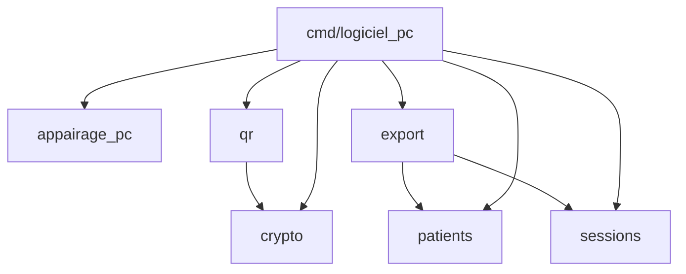
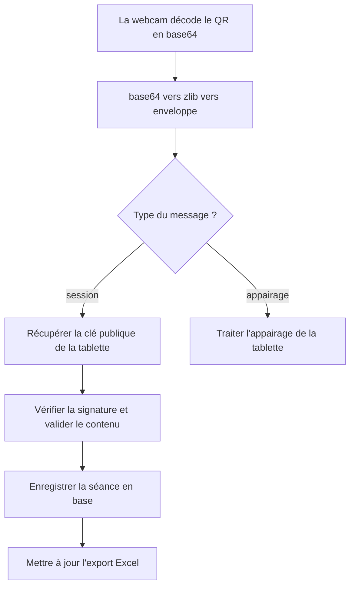
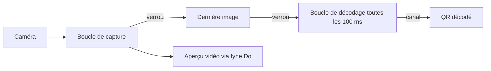

# OSEE — Documentation du logiciel praticien

---

## 1. Présentation du logiciel praticien

Le logiciel praticien est l'application qui tourne sur l'ordinateur du praticien. C'est le poste de commande du dispositif OSEE. Il garde l'identité des patients, reçoit les séances jouées sur la tablette, conserve l'historique et montre comment chaque enfant progresse.

Le logiciel fait quatre choses. Il crée les patients et produit le QR code de création de patient que la tablette va scanner. Il reçoit les résultats d'une séance en scannant le QR code que la tablette affiche à la fin. Il enregistre ces résultats dans une base locale, rattachés au bon patient. Il restitue le suivi sous trois formes : des fiches patients, des graphiques d'évolution et un export tableur par patient.

Le logiciel ne joue pas. Le jeu se passe entièrement sur la tablette. Le logiciel s'occupe seulement de gérer les patients et d'exploiter les données. Il n'a aucune connexion réseau : les données entrent uniquement par la caméra de l'ordinateur qui lit un QR code, et sortent uniquement par un QR code affiché à l'écran.

Le logiciel est écrit en Go, avec la bibliothèque graphique Fyne. Il se compile en un exécutable Windows autonome, qui ne demande rien à installer sur le poste du praticien.

---

## 2. L'architecture en packages

Le code est découpé en paquets, chacun avec une responsabilité claire. Les paquets qui portent la logique sont rangés sous internal/. Les programmes exécutables sont rangés sous cmd/.

Sous internal/, on trouve six paquets. Le paquet crypto signe et vérifie les messages avec Ed25519 ; c'est un habillage de la bibliothèque standard crypto/ed25519. Le paquet qr porte tout le protocole QR : la sérialisation des enveloppes, la génération des QR codes, le décodage et la vérification d'un QR reçu, et la capture de la webcam. Le paquet patients gère la base nominative des patients. Le paquet sessions stocke les séances reçues et calcule le suivi. Le paquet appairage_pc conserve l'appairage avec la tablette, c'est-à-dire la clé publique de la tablette. Le paquet export produit le classeur Excel de suivi.

Sous cmd/, on trouve trois programmes. Le programme logiciel_pc est l'application Fyne elle-même, avec son point d'entrée et tous ses écrans. Le programme generer_demo est un utilitaire qui fabrique une base de démonstration. Le programme test_genere_qr est un utilitaire de test qui génère une image de QR d'appairage.

Les dépendances entre paquets vont toujours dans le même sens, sans jamais former de cycle. Les paquets de base ne dépendent de personne, les paquets au-dessus s'appuient sur eux, et l'application réunit le tout. Aucun paquet de logique ne dépend de l'interface graphique.



Ce graphe est ce qu'on appelle un graphe orienté sans cycle. Il garantit que la logique métier, comme le calcul du suivi ou la vérification d'un message, se compile et se teste sans avoir besoin de l'interface graphique. C'est ce qui rend cette logique facile à vérifier.

---

## 3. La réception et le décodage d'un QR

Quand le praticien scanne un QR affiché par la tablette, le logiciel passe par une suite d'étapes avant d'accepter les données. Le décodage et la vérification sont dans internal/qr/reception.go. La classification du message et son traitement sont dans cmd/logiciel_pc/appairage_ui.go.

Le décodage transforme le texte du QR en enveloppe exploitable. Le QR contient une chaîne en base64, qui une fois décodée donne des données compressées en zlib, qui une fois décompressées donnent le JSON de l'enveloppe.

`internal/qr/reception.go`
```go
func LireChargeUtileQR(chargeUtileBase64 string) (Enveloppe, error)
```

Cette fonction appelle d'abord une étape interne qui défait le base64 puis le zlib, ensuite elle désérialise le JSON en enveloppe. À ce stade le logiciel a une enveloppe, mais il ne sait pas encore si elle est authentique.

La vérification contrôle la signature. Pour une séance, c'est la fonction suivante qui s'en charge.

`internal/qr/reception.go`
```go
func VerifierSession(enveloppe Enveloppe, tabPub []byte) (PayloadSession, error)
```

Elle vérifie le type, vérifie que la version vaut bien 3, lit le contenu en PayloadSession, recalcule la forme canonique du message avec SerialiserPourSignature et vérifie la signature avec crypto.Verifier en utilisant la clé publique de la tablette. Si la signature est bonne, elle valide encore le contenu : au moins une planche, des émotions valides, des scores et des compteurs dans les bornes attendues. Une enveloppe d'appairage suit le même principe avec sa propre fonction de vérification.

La classification choisit quoi faire selon le type du message.

`cmd/logiciel_pc/appairage_ui.go`
```go
func verifierChargeUtileScannee(...)
```

Cette fonction regarde le type de l'enveloppe et aiguille vers le bon traitement : le traitement d'un appairage de tablette, ou le traitement d'une séance.

Le flux complet d'une réception de séance se déroule donc ainsi. La webcam décode l'image du QR en une chaîne base64. La chaîne est lue en enveloppe par le décodage base64 puis zlib. Le type de l'enveloppe est examiné ; pour une séance, le traitement de session prend le relais. Ce traitement récupère la clé publique de la tablette, en mémoire si elle y est, sinon en la lisant dans la base d'appairage, puis il vérifie la séance. Une fois la séance vérifiée et validée, la date de séance est analysée et la séance est enregistrée en base. Enfin, l'export Excel du patient est mis à jour ; si cet export échoue, la séance reste quand même enregistrée.



---

## 4. Le stockage des séances

L'enregistrement d'une séance écrit dans trois tables liées : la séance elle-même, ses planches, et pour chaque planche les résultats par émotion. Le schéma exact de ces tables est décrit dans la documentation générale. Le code de stockage est dans internal/sessions/sessions.go.

`internal/sessions/sessions.go`
```go
func (d *DepotSessions) EnregistrerSession(ctx context.Context, patientID string, sessionDate time.Time, jeuType string, niveau int, planches []PlancheJouee, payloadJSON []byte) (Session, error)
```

L'enregistrement se fait en une transaction, pour que tout soit écrit ou rien. La fonction ouvre une transaction, puis prévoit une annulation automatique tant que la validation finale n'a pas eu lieu. Elle insère la ligne de la séance, puis pour chaque planche une ligne de planche jouée, puis pour chaque résultat une ligne de résultat par émotion. Le booléen qui indique si une émotion a été évaluée est converti en entier pour le stockage. Une fois toutes les écritures faites, la transaction est validée et l'annulation automatique est désactivée.

Ce fonctionnement en tout ou rien évite qu'une séance soit à moitié écrite. Si une erreur survient en cours de route, l'annulation ramène la base à son état d'avant, et aucune donnée partielle ne reste.

---

## 5. Le suivi patient et l'agrégation

Le suivi transforme les séances brutes en une vue lisible de la progression. Le calcul est dans internal/sessions/resume.go. Une partie est une fonction pure, qui agrège une séance, et une partie lit la base pour produire le suivi d'un patient.

`internal/sessions/resume.go`
```go
func AgregerResumeSeance(planches []PlancheJouee) ResumeSeance
func (d *DepotSessions) ResumeSeancesParPatient(ctx context.Context, patientID string) ([]SeanceResumee, error)
```

Une séance contient plusieurs planches, et le suivi a besoin d'un résultat par émotion au niveau de la séance entière. C'est le rôle de l'agrégation, qui suit une règle précise.

Le score d'une émotion sur la séance est la moyenne arrondie des scores de cette émotion, mais seulement sur les planches où l'émotion a été évaluée. Les compteurs, c'est-à-dire le nombre de cibles, le nombre de cibles trouvées et le nombre de faux positifs, sont les sommes sur ces mêmes planches évaluées. Une émotion compte comme évaluée au niveau de la séance dès qu'elle l'est sur au moins une planche.

Si une émotion n'est évaluée sur aucune planche de la séance, elle est marquée comme non évaluée, son score reste à zéro et ses compteurs à zéro. Ce cas est traité comme un trou, jamais comme un vrai zéro. La distinction est importante : un enfant qui n'a pas été testé sur la peur n'a pas échoué sur la peur.

Le score global de la séance est la moyenne arrondie des scores globaux de ses planches.

Le suivi d'un patient reprend toutes ses séances et les remet dans l'ordre chronologique, de la plus ancienne à la plus récente. Les émotions sont toujours présentées dans le même ordre : joie, colère, tristesse, peur.

---

## 6. Le graphique d'évolution

Le graphique montre l'évolution des scores du patient au fil des séances, avec une courbe par émotion. Il est dans cmd/logiciel_pc/graphique_evolution.go.

Le graphique est dessiné à la main, avec les primitives de base de Fyne : des lignes, des cercles, du texte et des rectangles. Aucune bibliothèque de graphique n'est utilisée. C'est un composant sur mesure, qui recalcule sa disposition à chaque changement de taille. Deux petites fonctions placent les points : une qui calcule la position horizontale selon le rang de la séance, une qui calcule la position verticale selon le score.

Chaque émotion a sa couleur. La joie est en ambre, la colère en rouge, la tristesse en bleu, la peur en violet.

Les trous sont gérés avec soin. La série d'une émotion est reconstruite en gardant l'information de savoir si chaque point a été évalué. Le dessin ne pose un marqueur que sur les points évalués, et il ne trace un segment entre deux séances que si les deux sont évaluées. Quand une émotion n'a pas été évaluée sur une séance, la courbe s'interrompt à cet endroit au lieu de chuter à zéro. Le graphique ne ment donc pas sur une fausse mauvaise performance.

---

## 7. L'export Excel

À chaque séance reçue, le logiciel met à jour un classeur Excel de suivi propre au patient. Le code est dans internal/export/export.go. Le classeur est produit avec la bibliothèque excelize, en version 2.10.1, choisie parce qu'elle est en pur Go, sous licence libre, et sans accès réseau. Ce choix est détaillé dans l'ADR-12.

`internal/export/export.go`
```go
func GenererClasseurPatient(patient patients.Patient, resumees []sessions.SeanceResumee, chemin string) error
func CheminExportPatient(dossierBase string, patient patients.Patient) string
```

Le classeur a trois feuilles. La feuille de synthèse présente quatre cartes, une par émotion, avec le dernier score et la tendance, puis un tableau croisant les séances et les émotions, avec un fond de couleur selon le score et une colonne de score global. La feuille de détail par séance donne pour chaque émotion le nombre de cibles trouvées sur le total, les faux positifs, la complétude, le score et le statut, évaluée ou non évaluée. La feuille d'évolution contient un bloc de données et un graphique natif en courbes, réglé pour laisser un trou quand une valeur manque.

La couleur de fond suit des seuils. Un score inférieur à 41 est en rouge, un score entre 41 et 75 est en ambre, un score de 76 ou plus est en vert. La couleur n'est appliquée qu'aux cellules évaluées, pour ne pas colorer un trou.

La tendance est calculée dans internal/export/tendance.go. Elle compare le premier et le dernier score évalué, avec un seuil de 10. Au-delà de dix points de hausse c'est une progression, au-delà de dix points de baisse c'est une régression, entre les deux c'est une stagnation, et sans évaluation c'est marqué comme non évalué.

Chaque fichier est nommé d'après les initiales et l'identifiant du patient, et rangé dans un dossier d'exports placé à côté du fichier de base.

---

## 8. La webcam

Pour scanner un QR, le logiciel a besoin de lire le flux de la caméra. La capture est dans internal/qr/webcam.go, et la boucle de scan avec aperçu est dans cmd/logiciel_pc/scan_apercu.go.

La capture est représentée par une source de frames, c'est-à-dire un objet capable de livrer une image puis de se fermer. Cette source est ouverte sur la caméra en résolution 640 sur 480. La capture s'appuie sur la bibliothèque mediadevices, qui utilise V4L2 sous Linux et DirectShow sous Windows. C'est ce qui permet au même code de fonctionner sur le poste de développement et sur le poste Windows du praticien.

Le scan fait tourner deux boucles en parallèle. Une boucle de capture lit les images en continu et les passe à l'aperçu vidéo. Une boucle de décodage essaie de lire un QR dans la dernière image disponible, à intervalle régulier, toutes les cent millisecondes. L'image partagée entre les deux boucles est protégée par un verrou, pour qu'une boucle ne lise pas pendant que l'autre écrit. Les résultats remontent par des canaux. L'aperçu met à jour l'affichage Fyne en passant par le mécanisme prévu pour cela, qui garantit que l'interface est modifiée depuis le bon fil d'exécution.



Séparer la capture et le décodage en deux boucles évite que le décodage, plus lent, ne bloque l'aperçu. L'aperçu reste fluide pendant que le décodage travaille sur les images au rythme qui lui convient.

---

## 9. L'interface Fyne

Tous les écrans de l'application sont dans le dossier cmd/logiciel_pc/. Chaque écran a son fichier.

La fenêtre principale, dans main.go, s'appelle Suivi patients. Elle montre le panneau des patients et la zone d'appairage, avec les boutons pour générer le QR d'appairage et pour scanner le QR de la tablette.

Le panneau des patients, dans patients_ui.go, affiche la liste des patients avec une recherche et un bouton pour créer un nouveau patient. C'est aussi là que se trouvent le formulaire de création, le choix du niveau, le démarrage d'une séance et l'affichage du QR de création de patient.

La fiche d'un patient, dans fiche_patient_ui.go, s'ouvre dans une fenêtre à onglets : un onglet pour le détail des séances et un onglet pour l'évolution. L'onglet d'évolution, construit dans graphique_evolution.go, contient le graphique et sa légende.

L'appairage et la réception sont dans appairage_ui.go : l'affichage du QR d'appairage du PC, et le traitement des QR scannés, qu'il s'agisse d'un appairage de tablette ou d'une séance.

Le scan par webcam, dans scan_ui.go, ouvre une fenêtre avec l'aperçu vidéo et un bouton pour annuler.

Deux fichiers à part portent de l'état et de la configuration. Le fichier session.go garde l'état d'appairage en mémoire pendant la session de travail, c'est-à-dire les clés et l'appairage en cours. Le fichier chemin_base.go résout le chemin du fichier de base, et gère le paramètre qui permet de pointer vers une base différente.

---

## 10. Compilation

Le logiciel se compile en un exécutable Windows autonome. La commande exacte et les détails de compilation sont donnés dans la documentation générale.

L'essentiel à retenir est que la compilation se fait depuis le dossier du logiciel, et qu'elle produit un seul fichier exécutable. Cette compilation a besoin de l'outillage mingw, parce que la bibliothèque graphique et la capture de la caméra utilisent du code qui doit être compilé pour Windows. Le fichier produit est autonome et ne demande rien à installer sur le poste du praticien.

---

*Documentation du logiciel praticien. Le fonctionnement d'ensemble du dispositif et le protocole d'échange sont décrits dans la documentation générale. L'application tablette est décrite dans sa propre documentation.*
