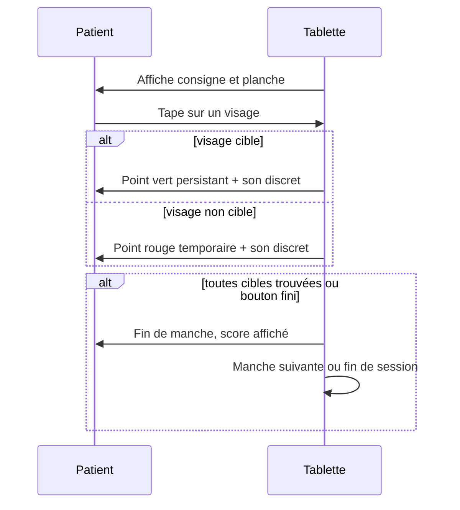

# Spécification du jeu des émotions

## Objet

Ce jeu est le premier contenu cognitif du projet. Il est destiné à être joué sur la tablette par des patients suivis pour TDAH ou troubles du spectre autistique. Le format retenu est inspiré du livre "Où est Charlie" : le patient voit à l'écran une planche dense remplie de petits visages exprimant chacun une émotion différente, et la consigne lui demande de trouver et de taper sur tous les visages exprimant une émotion donnée.

Ce format combine deux fonctions cognitives travaillées simultanément. La première est l'attention visuelle sélective, qui consiste à parcourir un champ visuel chargé et à isoler les éléments pertinents. La seconde est la reconnaissance des émotions sur les visages, qui est une compétence sociale de base souvent altérée dans le spectre autistique et qui peut être travaillée par exposition répétée.

## Mécanique générale du jeu

Une session de jeu se compose de plusieurs manches. Chaque manche est indépendante. Au début d'une manche, la tablette affiche une consigne en haut de l'écran du type "Trouve tous les visages joyeux". En dessous se trouve une planche remplie de petits visages disposés en grille ou de manière pseudo-aléatoire. Le patient tape sur les visages qu'il pense correspondre à la consigne. À chaque tap, un retour visuel immédiat apparaît sur le visage tapé : un point vert qui persiste si le visage correspond à la consigne, un point rouge qui s'efface au bout d'une seconde si le visage ne correspond pas. La manche se termine quand le patient a trouvé tous les visages cibles ou quand il appuie sur le bouton "J'ai fini".

La consigne change à chaque manche pour entraîner le patient à reconnaître toutes les émotions du jeu. L'ordre des consignes est tiré aléatoirement parmi les émotions du niveau courant.

La fin de session intervient au bout d'un nombre fixé de manches, typiquement cinq par session pour une première version. À la fin de la session, l'écran récapitule le score global et propose de quitter ou de rejouer.

## Niveaux de difficulté

Le jeu propose plusieurs niveaux de difficulté. Pour la première version du jeu, cinq niveaux sont définis, du plus facile au plus difficile. Le niveau joué est choisi par le praticien dans le logiciel PC au moment de générer le QR `creation_patient` et appliqué tel quel par la tablette, comme détaillé plus bas dans la section « Choix du niveau de difficulté ».

Le niveau 1 est introductif. La planche contient peu de visages au total et deux émotions seulement, joie et tristesse, qui sont les plus simples à distinguer. Les visages cibles sont nombreux par rapport au nombre total, ce qui rend la tâche facile sans pression.

Le niveau 2 ajoute une troisième émotion, la colère, et augmente la densité de la planche.

Le niveau 3 ajoute la peur et continue d'augmenter la densité.

Le niveau 4 ajoute la surprise. À ce niveau les émotions à distinguer commencent à être proches entre elles, notamment peur et surprise qui ont des expressions faciales similaires.

Le niveau 5 ajoute la dernière émotion, le dégoût, et présente la planche la plus dense. C'est le niveau le plus exigeant à la fois en attention et en discrimination émotionnelle.

Le tableau ci-dessous récapitule les paramètres par niveau.

| Niveau | Émotions               | Visages par planche | Cibles à trouver | Temps limite |
| ------ | ---------------------- | ------------------- | ---------------- | ------------ |
| 1      | joie, tristesse        | 12                  | 4 à 6            | aucun        |
| 2      | + colère               | 20                  | 5 à 7            | aucun        |
| 3      | + peur                 | 30                  | 6 à 9            | aucun        |
| 4      | + surprise             | 42                  | 7 à 10           | 90 secondes  |
| 5      | + dégoût               | 56                  | 8 à 12           | 60 secondes  |

Aucune contrainte de temps n'est appliquée aux trois premiers niveaux pour ne pas mettre le patient en situation de stress. Les niveaux 4 et 5 introduisent un temps limite parce qu'à ce stade la pression temporelle devient un travail cognitif pertinent et que le patient a déjà acquis la mécanique du jeu.

## Banque d'images et composition des planches

La banque d'images de base est constituée à partir d'**Open Peeps**, une bibliothèque d'illustrations dessinées à la main par Pablo Stanley, publiée sous licence CC0 (domaine public). Le choix d'illustrations dessinées plutôt que de photographies est délibéré : il évite tout problème de droit à l'image, il évite que des patients reconnaissent des personnes existantes ce qui pourrait perturber l'exercice, et il permet une diversité de styles capillaires, vestimentaires et de traits qui rend les planches visuellement intéressantes.

Pour chaque émotion du jeu, on prépare un ensemble de variantes de visages exprimant cette émotion, avec des coiffures et des traits différents pour assurer la diversité visuelle. Une planche est ensuite composée par tirage aléatoire de visages dans la banque, avec un nombre de cibles fixé par la consigne et le reste rempli avec des visages d'autres émotions tirés aléatoirement.

Le format des visages stockés est en PNG avec fond transparent, taille standardisée à 200×200 pixels, ce qui permet un affichage net sur la Tab P12 même quand la planche est dense. La banque est embarquée dans l'APK Flutter dans le dossier `assets/visages/` et organisée par sous-dossiers `joie/`, `tristesse/`, `colere/`, `peur/`, `surprise/`, `degout/`.

La composition d'une planche à l'écran utilise une grille pseudo-aléatoire : la planche est divisée en cellules de taille uniforme, et dans chaque cellule un visage est placé avec un léger décalage aléatoire pour éviter l'effet "grille parfaite" qui rendrait la recherche trop mécanique. Les cellules vides sont possibles pour éviter une saturation totale.

## Métriques enregistrées par session

Le jeu enregistre des métriques détaillées à plusieurs niveaux pendant chaque session. Ces métriques sont stockées localement dans la base SQLite de la tablette et seront transférées au logiciel praticien par QR code à la fin de la session.

Au niveau de la session globale on enregistre le `patient_id` et les `patient_initiales` reçus du PC dans le message `creation_patient` scanné en début de séance, la date et l'heure de début, le niveau de difficulté joué, le nombre de manches jouées, et l'heure de fin. Le score global de la session est calculé comme un agrégat des scores de manches.

Au niveau de chaque manche on enregistre l'émotion cible demandée, le nombre total de visages dans la planche, le nombre de cibles présentes, le nombre de cibles correctement trouvées, le nombre de faux positifs (cliqués mais non cibles), le nombre de cibles ratées (cibles non cliquées à la fin), le temps total de la manche, et un booléen indiquant si la manche a été interrompue par un abandon plutôt que terminée normalement.

Au niveau de chaque tap on enregistre le timestamp relatif au début de la manche, les coordonnées x et y du tap, l'émotion du visage tapé, et le booléen indiquant si c'était une cible ou un faux positif. Cette granularité permettra au praticien de visualiser le parcours d'attention du patient, par exemple repérer s'il a tapé en zigzag ou méthodiquement.

Les métriques de "patience" et "frustration" mentionnées dans les notes initiales du projet sont déduites de ces données brutes plutôt que mesurées directement. La frustration est inférée d'un taux élevé de faux positifs en peu de temps, d'abandons rapides, ou de longues pauses entre les taps. La patience est inférée du temps moyen pris pour scanner la planche avant le premier tap.

## Format du payload session

À la fin de la session, la tablette construit un payload conforme à la spécification du protocole QR documentée dans `docs/specs/protocole_qr.md`. Le type du message est `session`, la version est 2, et la structure du payload est la suivante.

Le payload contient le `patient_id` et les `patient_initiales` repris tels quels du message `creation_patient` reçu en début de séance, la `session_date` au format ISO 8601 UTC qui marque le début effectif de la séance, le `jeu_type` qui vaut `emotions` pour ce jeu, le `niveau` joué, et un tableau `manches`. Chaque manche contient son `emotion_cible`, ses métriques agrégées, et son tableau `taps`. Chaque tap contient son timestamp relatif, ses coordonnées, l'émotion du visage tapé, et le booléen de réussite.

L'enveloppe complète est signée par la tablette avec sa clé privée ed25519, et le PC vérifie la signature à réception comme prévu dans la spec QR.

## Choix du niveau de difficulté

Le niveau de difficulté de chaque session est choisi explicitement par le praticien dans le logiciel PC au moment de générer le QR `creation_patient`. Ce choix s'appuie sur le jugement clinique du praticien à partir de ce qu'il a observé lors des séances précédentes du patient, des objectifs thérapeutiques de la séance courante, et de l'état du patient le jour donné. La valeur saisie est transmise dans le champ `niveau_demande` du message `creation_patient` conformément à la spec QR version 2.

La tablette applique strictement le niveau reçu sans le modifier ni le contester. Elle ne maintient pas d'historique des sessions précédentes du patient et n'effectue aucun calcul d'adaptation. Cette répartition est cohérente avec l'ADR-07 qui confie au PC la responsabilité de l'identification patient et, par extension, les choix qui dépendent de l'historique nominatif.

Une évolution post-soutenance est envisagée pour introduire un calcul de niveau recommandé côté PC, basé sur l'historique des sessions reçues précédemment du même patient. Cette recommandation serait transmise via un champ `niveau_recommande` complémentaire ou en remplacement de `niveau_demande` dans le message `creation_patient`. La décision serait alors tracée par un nouvel ADR et le protocole QR évoluerait en version 3. À ce stade du projet et pour le périmètre fin juin, le choix manuel est suffisant et défendable par l'argument que le jugement clinique du praticien prime sur l'algorithme.

## Écrans et navigation

Le jeu s'intègre dans l'application tablette existante. Il est accessible depuis la route `/jeu` actuellement occupée par un placeholder. La navigation depuis l'écran d'accueil est revue conformément à l'ADR-07 et à la spec QR version 2 : si un appairage avec le PC existe en base, le bouton "Nouveau patient" ouvre directement le scanner de caméra arrière pour lire un QR `creation_patient` généré par le logiciel PC. Après scan et vérification de signature avec `pc_pub`, la tablette affiche un écran de confirmation du type "Patient MD chargé. Prêt à jouer.", le praticien valide, et la tablette enchaîne sur la sélection de jeu (qui ne propose qu'un jeu pour l'instant), puis sur l'écran de jeu lui-même.

Aucun écran de sélection ou de création de patient n'est implémenté côté tablette. La feature `profil_patient` initialement envisagée n'existera pas. Le scan du QR `creation_patient` réutilise la cinématique de scan déjà en place pour l'appairage et s'appuie sur les mêmes modules `qr` et `crypto`.

L'écran de jeu lui-même est implémenté dans `lib/features/jeu_emotions/` selon l'arborescence prescrite par le `CLAUDE.md` du sous-projet tablette : `domain.dart` pour les types métier, `data.dart` pour l'accès aux assets et au stockage, `controller.dart` pour les providers Riverpod qui orchestrent la boucle de jeu, et `ui/` pour les widgets.

L'écran principal du jeu affiche en haut une barre de progression (manche courante sur manches totales) et la consigne du moment. Au centre se trouve la planche scrollable si besoin (probablement pas pour les niveaux 1 à 3, peut-être pour les niveaux 4 et 5 selon la densité). En bas se trouve un bouton "J'ai fini" pour valider la manche et un bouton "Arrêter" pour abandonner la session avec confirmation.

Quand la manche se termine, un écran de transition affiche brièvement le score de la manche avec un encouragement neutre et bienveillant, puis enchaîne sur la manche suivante au bout de trois secondes ou au tap du patient.

À la fin de la session, un écran récapitulatif affiche le score global, propose un bouton pour générer le QR de session à scanner par le PC, et un bouton pour quitter sans transférer.

## Considérations ergonomiques et accessibilité

Le jeu cible des enfants et adolescents, donc l'ergonomie tactile doit tenir compte de cibles potentiellement imprécises. La taille minimale d'un visage tactile est fixée à 80 pixels de côté pour la zone de tap effective, même si l'image affichée est plus petite visuellement. Cette zone de tap englobante est invisible pour ne pas perturber le rendu visuel.

Les retours visuels (point vert ou rouge) sont accompagnés de retours sonores discrets mais distincts, et de retours haptiques courts (vibration de 50 millisecondes pour un tap correct, 100 millisecondes pour un tap incorrect). Ces retours peuvent être désactivés dans les paramètres si nécessaire.

Les couleurs des points de feedback respectent un contraste suffisant pour être visibles par des patients avec une perception altérée des couleurs : le vert utilisé est un vert vif `#2ECC71` et le rouge un rouge vif `#E74C3C`, complétés respectivement d'une icône check et d'une icône croix pour ne pas dépendre uniquement de la couleur.

L'orientation paysage est forcée comme pour le reste de l'application.

## Tests prévus

Les tests unitaires couvrent la logique de composition de planche (tirage aléatoire avec bon nombre de cibles et bonne répartition) et la logique de scoring (calcul correct du taux de réussite et détection des abandons).

Les tests de widget couvrent l'affichage de l'écran de jeu, la réaction aux taps simulés sur des visages cibles et non cibles, et l'enchaînement des manches.

Les tests d'intégration couvrent le flux complet d'une session : scan d'un QR `creation_patient` simulé via une image PNG fixture et vérification de signature, jeu de plusieurs manches, génération du QR de session, vérification que le payload produit est conforme à la spec QR version 2.

Le test manuel sur Lenovo Tab P12 couvre tout ce que les tests automatisés ne peuvent pas valider : l'ergonomie tactile réelle, la fluidité d'affichage des planches denses, la lisibilité des visages à taille réelle, la qualité des retours haptiques et sonores, et l'expérience utilisateur globale.

## Risques identifiés

Le risque principal est la qualité et la quantité d'images Open Peeps disponibles pour les six émotions. Le SVG d'Open Peeps permet de composer des personnages mais il faut générer les expressions faciales correspondantes à chaque émotion, ce qui demande un travail de production en amont. Selon les options disponibles dans la bibliothèque, certaines émotions comme le dégoût peuvent être moins bien représentées que d'autres comme la joie. Une tâche préparatoire du sprint 3 est dédiée à la constitution de la banque.

Le second risque est la performance d'affichage sur la Tab P12 avec des planches denses (jusqu'à 56 visages au niveau 5). Flutter gère normalement bien ce type de rendu mais une vérification précoce sur le matériel cible est nécessaire pour éviter des saccades qui rendraient le jeu inutilisable.

Le troisième risque est l'équilibrage des niveaux. Les paramètres proposés dans le tableau sont une première estimation et devront probablement être ajustés après les premiers tests utilisateurs. Une variable de configuration centralisée permettra de modifier ces paramètres sans toucher au code.
