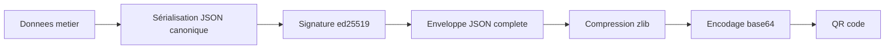

# Spécification du protocole QR - Version 3

## Historique des versions

La version 1 de cette spec a été rédigée au début du sprint 2. Elle définissait trois types de messages : `appairage_pc`, `appairage_tablette`, et `session`. Le type `session` portait alors un `patient_id` généré côté tablette, et la création de patient se faisait sur la tablette.

La version 2 est introduite suite à la décision tracée dans l'ADR-07 qui transfère la responsabilité de l'identification patient au PC. Elle introduit un quatrième type de message `creation_patient` allant du PC vers la tablette, et adapte le type `session` pour transporter le `patient_id` reçu du PC plutôt qu'un identifiant local.

Cette spec version 2 supersède la version 1. Le champ `version` de l'enveloppe passe de 1 à 2. Les deux versions sont mutuellement exclusives : un message version 1 reçu par une application version 2 est rejeté avec le message "Versions incompatibles", et inversement.

La version 3 est introduite suite à la décision tracée dans l'ADR-11, elle-même consécutive à la refonte du jeu actée par l'ADR-10. Elle ne change ni les types de messages ni le modèle cryptographique : seule la structure du `payload` du message `session` évolue, le tableau `manches` mono-émotion étant remplacé par un tableau `planches` portant pour chaque planche le détail par émotion. Le champ `version` de l'enveloppe passe de 2 à 3. Comme pour le passage précédent, aucune compatibilité ascendante n'est maintenue : un message version 2 reçu par une application version 3 est rejeté pour incompatibilité de version.

## Objet

Le canal QR est le seul moyen de communication entre la tablette et le PC du praticien. Il transporte maintenant quatre types de messages distincts.

Le premier type est le message d'appairage initial du PC vers la tablette, généré au moment de la première mise en service du dispositif et scanné par la tablette. Le second type est la réponse d'appairage de la tablette vers le PC, scannée par la webcam du PC. Ces deux premiers types complètent la cinématique d'appairage bidirectionnel et n'ont pas changé par rapport à la version 1.

Le troisième type est nouveau dans cette version 2. C'est le message de création de session pour un patient, généré par le PC à chaque démarrage de séance et scanné par la tablette. Il transmet à la tablette le contexte minimal nécessaire pour démarrer une séance : l'identifiant anonyme du patient et ses initiales pour confirmation visuelle.

Le quatrième type est le message de session généré par la tablette à la fin d'une séance et scanné par la webcam du PC. Il porte les métriques de jeu rattachées au `patient_id` reçu en début de séance.

## Modèle cryptographique

Le modèle cryptographique reste celui de la version 1. La tablette et le PC se sont échangés leurs clés publiques ed25519 au moment de l'appairage initial. Chaque message après l'appairage est signé par son émetteur et vérifié par son destinataire.

Concrètement, le message `creation_patient` est signé par le PC avec sa `pc_priv` et vérifié par la tablette avec `pc_pub`. Le message `session` est signé par la tablette avec sa `tab_priv` et vérifié par le PC avec `tab_pub`. Cette double signature garantit l'authenticité bidirectionnelle des données échangées.

## Format de la charge utile

Le format d'enveloppe reste celui de la version 1. JSON encodé en UTF-8, compressé via zlib, encodé en base64 standard pour rentrer dans un QR alphanumérique. L'enveloppe contient les champs `type`, `version` (qui vaut maintenant 3), `timestamp`, `payload`, et `signature`. La canonicité de la sérialisation JSON reste cruciale pour la vérification des signatures.



## Détail des quatre types

### Message `appairage_pc`

Inchangé par rapport à la version 1. Généré par le PC. Le `payload` contient un `pairing_id` UUID v4 et la clé publique du PC en base64. Pas de signature, c'est le message qui établit la confiance.

### Message `appairage_tablette`

Inchangé par rapport à la version 1. Généré par la tablette en réponse au scan d'un `appairage_pc`. Le `payload` contient le même `pairing_id` et la clé publique de la tablette en base64. Signé par la tablette avec `tab_priv`.

### Message `creation_patient`

Nouveau dans la version 2. Généré par le PC au moment où le praticien clique sur "Démarrer une séance pour ce patient" dans le logiciel PC. Le `payload` contient trois champs.

Le premier champ est `patient_id`, qui est l'identifiant anonyme unique de ce patient dans la base PC. Il est généré sous forme d'UUID v4 au moment de la création du patient et ne change jamais. C'est cet identifiant qui sera repris par la tablette dans le message `session` de fin de séance, ce qui permet au PC de rattacher les données reçues à la bonne fiche nominative.

Le second champ est `patient_initiales`, qui contient les initiales du patient sous forme d'une chaîne de 2 à 3 caractères majuscules. Ce champ existe uniquement pour permettre à la tablette d'afficher au praticien une confirmation visuelle du type "Patient MD chargé, prêt à jouer". Le praticien peut ainsi vérifier en un coup d'œil qu'il n'a pas scanné le mauvais QR. Les initiales ne sont pas persistées sur la tablette au-delà de la session en cours.

Le troisième champ est `niveau_demande`, qui est un entier compris entre 1 et 5 correspondant aux cinq niveaux de difficulté du jeu des émotions. Il est saisi par le praticien dans le logiciel PC au moment de générer le QR, sur la base de son jugement clinique. La tablette applique strictement ce niveau pour la session sans le modifier. Ce champ matérialise dans le protocole la décision tracée par l'ADR-07 de confier au praticien les choix qui dépendent de l'historique nominatif, plutôt que de les déléguer à un moteur d'adaptation automatique côté tablette.

Le message est signé par le PC avec sa `pc_priv`. La tablette vérifie cette signature à la réception avec la `pc_pub` reçue lors de l'appairage. Si la signature est invalide, le QR est rejeté avec le message d'erreur "Patient non vérifié, l'appairage a peut-être été perdu".

### Message `session`

Adapté en version 3 par rapport à la version 2. Le `payload` conserve les champs d'en-tête suivants, inchangés : le `patient_id` reçu du PC dans le message `creation_patient` correspondant à cette session, les `patient_initiales` reprises telles quelles pour la vérification visuelle côté PC, la `session_date` au format ISO 8601 UTC marquant le début de la séance, le `jeu_type` qui vaut `emotions` pour le premier jeu, et le `niveau` joué.

Le détail de jeu n'est plus porté par un tableau `manches` mono-émotion comme en version 2, mais par un tableau `planches`, conformément à l'ADR-10 qui a refondu le jeu en navigation libre entre émotions sur une même planche. Chaque élément du tableau `planches` décrit une planche jouée et contient son `numero_planche`, son `score_global` entier borné entre zéro et cent, et un sous-tableau `resultats_par_emotion`.

Chaque élément de `resultats_par_emotion` porte le résultat d'une émotion sur cette planche. Il contient l'`emotion`, qui prend l'une des quatre valeurs `joie`, `colere`, `tristesse` ou `peur`, le `nb_cibles_total` de cette émotion sur la planche, le `nb_cibles_trouvees`, le `nb_faux_positifs`, le `score` entier borné entre zéro et cent, et le booléen `evaluee` indiquant si l'émotion a été retenue pour l'évaluation de la planche. Une émotion non retenue porte `evaluee` à faux ; elle ne doit pas être confondue avec un score nul, car elle traduit le fait que le patient n'a pas été évalué sur cette émotion pour cette planche, et non qu'il a échoué.

Le détail tap par tap n'est pas transmis. Il reste collecté en mémoire sur la tablette mais n'entre pas dans le QR, ce qui préserve la capacité du QR puisqu'on ne transmet que des compteurs et des scores agrégés par émotion.

Le message est signé par la tablette avec sa `tab_priv`. Le PC le vérifie avec `tab_pub` à la réception, puis valide la structure du payload : présence d'au moins une planche, chaque planche portant au moins un résultat d'émotion, émotion appartenant à l'ensemble connu, scores dans leurs bornes et compteurs cohérents. Un payload authentique mais malformé est rejeté franchement plutôt qu'enregistré partiellement, afin d'éviter tout échec silencieux.

À titre d'illustration, un payload `session` version 3 a la forme suivante.

```json
{
  "patient_id": "8f3b2c1a-...-4e7d",
  "patient_initiales": "MD",
  "session_date": "2026-06-11T10:00:00.000Z",
  "jeu_type": "emotions",
  "niveau": 3,
  "planches": [
    {
      "numero_planche": 1,
      "score_global": 82,
      "resultats_par_emotion": [
        { "emotion": "joie", "nb_cibles_total": 3, "nb_cibles_trouvees": 3, "nb_faux_positifs": 0, "score": 100, "evaluee": true },
        { "emotion": "colere", "nb_cibles_total": 2, "nb_cibles_trouvees": 1, "nb_faux_positifs": 1, "score": 45, "evaluee": true },
        { "emotion": "tristesse", "nb_cibles_total": 0, "nb_cibles_trouvees": 0, "nb_faux_positifs": 0, "score": 0, "evaluee": false },
        { "emotion": "peur", "nb_cibles_total": 1, "nb_cibles_trouvees": 1, "nb_faux_positifs": 0, "score": 100, "evaluee": true }
      ]
    }
  ]
}
```

#### Format `manches` de la version 2, obsolète

Le format version 2 du message `session` portait un tableau `manches` où chaque manche décrivait une seule émotion cible avec son `emotion_cible`, ses compteurs de cibles et de faux positifs, un `temps_total_ms`, un booléen `abandonnee` et un sous-tableau `taps`. Ce format est obsolète depuis la version 3 et n'est plus accepté. Un PC version 3 qui reçoit un payload `manches` le rejette comme payload invalide.

## Cinématique d'usage type

Le scénario nominal d'une séance est le suivant.

Au préalable, l'appairage a été fait une fois pour toutes lors de la première mise en service. La tablette et le PC connaissent leurs clés publiques mutuelles.

Le praticien lance le logiciel PC, sélectionne un patient existant dans sa base ou en crée un nouveau s'il s'agit d'une première séance. Il choisit le niveau de difficulté de la séance sur la base de son jugement clinique, puis clique sur "Démarrer une séance" pour ce patient. Le logiciel PC génère un message `creation_patient` signé contenant le `patient_id`, les `patient_initiales` et le `niveau_demande`, et l'affiche sous forme de QR dans une nouvelle fenêtre.

Le praticien prend la tablette, lance l'application, et clique sur "Nouveau patient" sur l'écran d'accueil. La tablette ouvre directement la caméra arrière pour scanner le QR. Le praticien pointe la caméra vers le QR affiché sur le PC. La tablette décode le QR, vérifie la signature avec `pc_pub`, extrait le `patient_id`, les `patient_initiales` et le `niveau_demande`, et affiche un écran de confirmation "Patient MD chargé. Prêt à jouer.". Le praticien valide et la tablette enchaîne sur la sélection du jeu, qui démarrera directement au niveau reçu.

Le patient joue. La tablette accumule les métriques en mémoire et en base SQLite locale, rattachées au `patient_id` courant.

À la fin de la session, la tablette construit un message `session` signé qui contient toutes les métriques rattachées au `patient_id`, et l'affiche sous forme de QR. Le praticien revient sur le PC, clique sur "Recevoir une session", et la webcam scanne le QR de la tablette. Le PC décode, vérifie la signature avec `tab_pub`, et insère les métriques dans sa base en les rattachant au patient identifié par `patient_id`.

Le PC met à jour automatiquement le fichier Excel mère qui agrège toutes les sessions de tous les patients.

## Gestion d'erreur sur le patient_id

Si la tablette reçoit un message `creation_patient` et que le praticien se rend compte qu'il a scanné le mauvais patient, il scanne simplement un autre QR `creation_patient` depuis le PC. Le nouveau `patient_id` remplace l'ancien dans le contexte de session de la tablette. Aucune donnée n'a encore été produite à ce stade puisque le jeu n'a pas commencé, donc rien à invalider.

Si le PC reçoit un message `session` avec un `patient_id` qu'il ne reconnaît pas, ce qui ne devrait pas arriver dans un usage normal, il affiche au praticien un dialogue d'erreur "Session reçue pour un patient inconnu. Vérifiez que cette tablette est bien appairée avec ce PC.". Aucune donnée n'est insérée tant que la cause n'est pas comprise.

## Taille maximale et stratégie de découpage

La stratégie de découpage en plusieurs QR successifs définie en version 1 reste applicable et n'a pas changé. Une session typique de cinq planches au jeu des émotions rentre largement dans un QR unique. Le message `creation_patient` est encore plus petit, environ 200 octets, donc aucun risque de dépassement.

## Niveau de correction d'erreur du QR

Inchangé. Niveau M (medium) pour tous les QR du protocole.

## Stockage des clés

Inchangé. Côté tablette, les clés `tab_priv`, `tab_pub` et `pc_pub` sont stockées dans la table `appairage` de SQLite. Côté PC, les clés `pc_priv`, `pc_pub` et `tab_pub` sont stockées dans la base SQLite PC qui sera implémentée au sprint 3 pour la gestion des patients.

## Versionnement du protocole

La version courante du protocole est désormais 3. Un message reçu avec une version différente de 3 est rejeté avec un message clair indiquant l'incompatibilité.

Les versions 1 et 2 sont considérées comme obsolètes. La version 1 n'a jamais été déployée. La version 2 a été implémentée et testée mais n'a pas été déployée en production durable ; son passage en version 3 accompagne la refonte du jeu en navigation libre actée par l'ADR-10 et le changement de structure du message `session`. Aucune compatibilité ascendante n'est maintenue entre versions. Cette décision est tracée dans l'ADR-11.

Toute future évolution majeure du protocole incrémentera ce champ et fera l'objet d'une version explicite.
