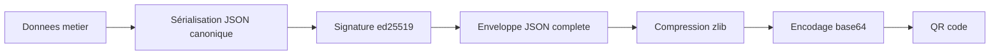

# Spécification du protocole QR

## Objet

Le canal QR est le seul moyen de communication entre la tablette et le PC du praticien. Il transporte deux types de messages distincts. Le premier type est le message d'appairage, généré par le PC et scanné par la tablette une fois pour établir un secret partagé. Le second type est le message de session, généré par la tablette en fin de séance et scanné par la webcam du PC pour transférer les métriques de jeu d'un patient identifié par ses initiales et son identifiant aléatoire.

Cette spécification définit le format des deux messages, leur taille maximale, leur mécanisme de signature, et la stratégie de découpage si la charge utile dépasse la capacité d'un QR unique.

## Modèle cryptographique

L'appairage établit une clé publique ed25519 du PC connue de la tablette. Toutes les sessions générées par la tablette sont signées par la tablette avec sa propre clé privée ed25519, et la signature est vérifiée par le PC avec la clé publique correspondante.

Concrètement la cinématique est la suivante. Le PC génère à sa première utilisation une paire de clés ed25519 `pc_priv` et `pc_pub` qu'il stocke dans sa base SQLite. La tablette génère également à sa première utilisation une paire de clés ed25519 `tab_priv` et `tab_pub` qu'elle stocke localement. Lors de l'appairage, le PC affiche un QR qui contient `pc_pub` et un identifiant d'appairage. La tablette scanne ce QR, mémorise `pc_pub`, et affiche immédiatement un second QR qui contient `tab_pub` que le PC scanne en retour. À la fin de cette procédure, chaque côté connaît la clé publique de l'autre et peut vérifier les signatures qu'il reçoit.

Cette cinématique implique deux scans pendant l'appairage. C'est un coût acceptable parce que l'appairage est fait une seule fois par couple tablette plus PC.

## Format de la charge utile

Toutes les charges utiles sont du JSON encodé en UTF-8, puis compressé via zlib pour réduire le volume, puis encodé en base64 standard pour rentrer proprement dans un QR alphanumérique. Le passage par base64 réduit la capacité utile mais garantit la portabilité et évite les problèmes d'encodage de caractères entre Flutter et Go.

L'enveloppe est uniforme pour tous les messages. Elle contient un champ `type` qui prend l'une des valeurs `appairage_pc`, `appairage_tablette`, ou `session`. Elle contient un champ `version` qui vaut `1` pour cette première version du protocole. Elle contient un champ `timestamp` au format ISO 8601 UTC. Elle contient un champ `payload` dont le contenu dépend du type. Elle contient un champ `signature` qui est la signature ed25519 de la concaténation des champs `type`, `version`, `timestamp` et `payload` sérialisés en JSON canonique.

## Détail des trois types

### Message `appairage_pc`

Généré par le PC. Le `payload` contient un identifiant de session d'appairage `pairing_id` qui est un UUID v4, et la clé publique du PC `pc_pub` encodée en base64. Ce message n'est pas signé puisque c'est lui qui établit la confiance, le champ `signature` est une chaîne vide. La charge JSON brute fait moins de 200 octets, le QR généré est petit et facilement scannable.

### Message `appairage_tablette`

Généré par la tablette en réponse au scan d'un `appairage_pc`. Le `payload` contient le même `pairing_id` que celui reçu du PC, et la clé publique de la tablette `tab_pub` encodée en base64. Ce message est signé par la tablette avec `tab_priv`, ce qui prouve au PC que la clé publique reçue n'a pas été falsifiée pendant l'affichage.

### Message `session`

Généré par la tablette en fin de séance de jeu. Le `payload` contient les initiales du patient `patient_initiales` (deux à trois caractères), l'identifiant aléatoire du patient `patient_id` (un nombre entier sur six chiffres), la date de la session `session_date` au format ISO 8601, le type de jeu `jeu_type` qui vaut `emotions` au sprint 3, le niveau de difficulté joué, et un tableau `tentatives` qui liste chaque tentative avec ses métriques. Chaque tentative contient une réponse attendue, une réponse donnée, le booléen de réussite, le temps de réaction en millisecondes, et un horodatage relatif au début de la session.

Le message est signé par la tablette avec `tab_priv`. Le PC le vérifie avec `tab_pub` reçue lors de l'appairage. Si la signature est invalide, le message est rejeté et un message d'erreur explicite est affiché au praticien.

## Taille maximale et stratégie de découpage

Un QR de version 40 avec correction d'erreur de niveau M peut contenir environ 2300 caractères alphanumériques. En base64 cela représente environ 1700 octets de données binaires utiles avant base64. Une session typique de quinze tentatives au jeu des émotions, sérialisée puis compressée, fait entre 600 et 900 octets selon les variations, donc rentre largement dans un QR unique.

Pour être robuste face à des sessions plus longues ou des futurs jeux qui généreraient plus de données, le protocole prévoit un découpage en plusieurs QR. Quand la charge utile dépasse 1500 octets après compression, la tablette segmente le base64 en parties de 1500 caractères et génère plusieurs QR successifs. Chaque QR est préfixé par une trame de contrôle `PART:n/N:hash:` où `n` est le numéro de partie à partir de 1, `N` est le nombre total de parties, et `hash` est un hash sha256 court (les seize premiers caractères) du base64 complet pour vérifier la reconstitution. Le PC scanne les QR un par un, et l'opérateur peut passer au suivant en cliquant un bouton. Quand toutes les parties sont reçues, le PC concatène, vérifie le hash, puis décode normalement.

Cette stratégie n'est pas activée pour la première version puisque le jeu des émotions reste sous le seuil, mais le code la prévoit dès le sprint 2 pour ne pas avoir à refactoriser plus tard.

## Niveau de correction d'erreur du QR

Le niveau de correction d'erreur du QR généré est `M` (medium), qui permet de récupérer environ 15 % du QR endommagé. Ce niveau est un bon compromis entre capacité et robustesse face à des conditions d'éclairage moyennes en cabinet.

## Stockage des clés

Côté tablette, les clés `tab_priv` et `tab_pub` ainsi que la clé `pc_pub` reçue lors de l'appairage sont stockées dans la base SQLite locale dans une table `appairage`. Côté PC, les clés `pc_priv` et `pc_pub` ainsi que la clé `tab_pub` reçue sont stockées dans la base SQLite locale dans une table `appairage`.

La clé privée n'est pas chiffrée à ce stade, le chiffrement de la base SQLite est repoussé en backlog post-soutenance. La justification est que la base est déjà protégée par les permissions du système de fichiers, qu'aucun secret n'est stocké en clair en dehors de la base, et que la clé n'est jamais transmise. Cette décision est tracée dans un ADR à venir.

## Cas d'erreur

Le scan échoue ou produit un base64 corrompu : la tablette ou le PC affiche un message "QR illisible, réessayez" et n'enregistre rien.

La signature du message `session` est invalide : le PC affiche "Session non vérifiée, l'appairage a peut-être été perdu" et invite le praticien à refaire l'appairage. Aucune donnée n'est enregistrée.

Le `pairing_id` du message `appairage_tablette` ne correspond pas à celui généré par le PC : le PC affiche "Appairage non reconnu" et n'enregistre rien.

Une session avec un `patient_id` déjà inconnu côté PC : le logiciel PC affiche un dialogue qui demande au praticien si le patient existe sous un autre nom, et propose soit d'associer la session à une fiche existante par sélection manuelle, soit de créer une nouvelle fiche avec les initiales et l'identifiant reçus. Cette logique est gérée côté PC, la tablette n'a pas à connaître la base nominative.

## Versionnement du protocole

Le champ `version` permet une évolution future. Si un message arrive avec une version inconnue, le récepteur affiche un message clair indiquant que les deux applications ne sont pas dans des versions compatibles et qu'une mise à jour est nécessaire. Aucun fallback automatique n'est tenté.
